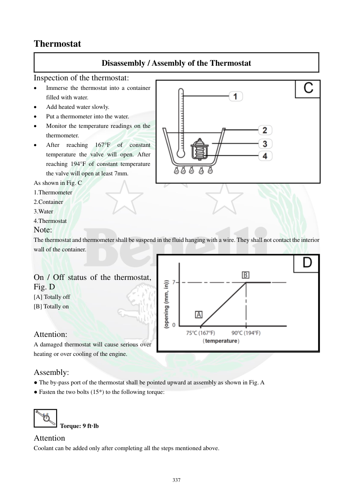

# Manual page 338

> Source: [page-0338.md](../source/page-0338.md)

## Page image / diagram

- [page-0338-img-02.png](../images/embedded/page-0338-img-02.png)

- [page-0338-img-03.png](../images/embedded/page-0338-img-03.png)

## Extracted text

# Source page 338

 
337 
Thermostat 
Disassembly / Assembly of the Thermostat 
Inspection of the thermostat: 
 
Immerse the thermostat into a container 
filled with water. 
 
Add heated water slowly. 
 
Put a thermometer into the water. 
 
Monitor the temperature readings on the 
thermometer.  
 
After 
reaching 
167°F 
of 
constant 
temperature the valve will open. After 
reaching 194°F of constant temperature 
the valve will open at least 7mm.  
As shown in Fig. C 
1.Thermometer 
2.Container 
3.Water  
4.Thermostat 
Note: 
The thermostat and thermometer shall be suspend in the fluid hanging with a wire. They shall not contact the interior 
wall of the container.  
 
 
On / Off status of the thermostat, 
Fig. D 
[A] Totally off 
[B] Totally on 
 
 
Attention: 
A damaged thermostat will cause serious over 
heating or over cooling of the engine.   
 
Assembly: 
● The by-pass port of the thermostat shall be pointed upward at assembly as shown in Fig. A 
● Fasten the two bolts (15*) to the following torque: 
 
 Torque: 9 ft·lb 
Attention 
Coolant can be added only after completing all the steps mentioned above.

## Persian notes

### تست و مونتاژ ترموستات
- ترموستات را داخل ظرف آب قرار دهید و آب را به‌آرامی گرم کنید؛ دماسنج نیز باید داخل آب قرار داشته باشد.
- ترموستات و دماسنج نباید با دیواره ظرف تماس داشته باشند و بهتر است با سیم در سیال معلق باشند.
- طبق متن تست، در **167°F (حدود 75°C)** شیر شروع به بازشدن می‌کند و در **194°F (حدود 90°C)** باید حداقل **7 mm** باز شده باشد.
- ترموستات کاملاً بسته و کاملاً باز طبق شکل صفحه بررسی می‌شود.
- ترموستات معیوب می‌تواند باعث **داغ‌شدن بیش از حد یا خنک‌کاری بیش از حد موتور** شود.
- هنگام نصب، مسیر **By-pass** ترموستات باید رو به بالا باشد.
- گشتاور دو پیچ کاور ترموستات: **9 ft·lb**.
- مایع خنک‌کننده فقط بعد از تکمیل مراحل نصب اضافه شود.
- این صفحه معیار تست **75 تا 90°C** را ارائه می‌کند و برای اختلاف با مقادیر صفحه 332 باید تصویر/متن اصلی هر دو صفحه در نظر گرفته شود.
