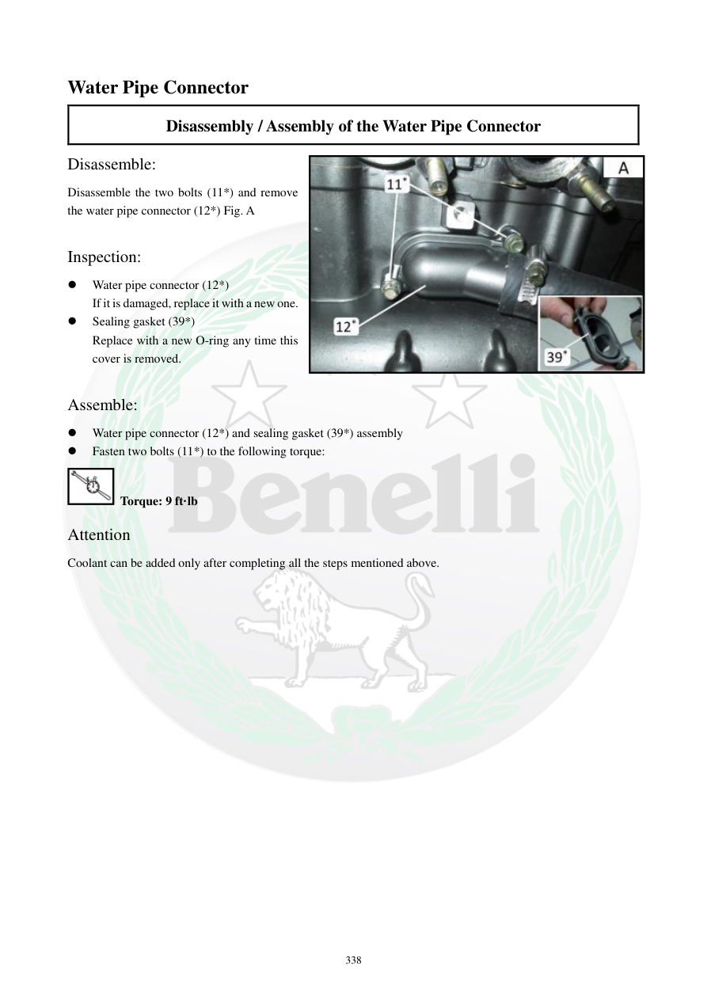

# Manual page 339

> Source: [page-0339.md](../source/page-0339.md)

## Page image / diagram

- [page-0339-img-02.jpeg](../images/embedded/page-0339-img-02.jpeg)

## Extracted text

# Source page 339

 
338 
Water Pipe Connector 
Disassembly / Assembly of the Water Pipe Connector 
Disassemble: 
Disassemble the two bolts (11*) and remove 
the water pipe connector (12*) Fig. A 
 
Inspection: 
 
Water pipe connector (12*) 
If it is damaged, replace it with a new one.  
 
Sealing gasket (39*) 
Replace with a new O-ring any time this 
cover is removed.  
 
Assemble: 
 
Water pipe connector (12*) and sealing gasket (39*) assembly  
 
Fasten two bolts (11*) to the following torque: 
 Torque: 9 ft·lb 
Attention 
Coolant can be added only after completing all the steps mentioned above.

## Persian notes

### اتصال لوله آب
- دو پیچ اتصال‌دهنده باز و Water Pipe Connector جدا شود.
- خود اتصال‌دهنده از نظر آسیب بررسی و در صورت خرابی تعویض شود.
- **اورینگ آب‌بندی هر بار که این کاور باز می‌شود باید با نمونه نو تعویض شود.**
- گشتاور دو پیچ اتصال‌دهنده: **9 ft·lb**.
- مایع خنک‌کننده فقط پس از تکمیل مونتاژ اضافه شود.
