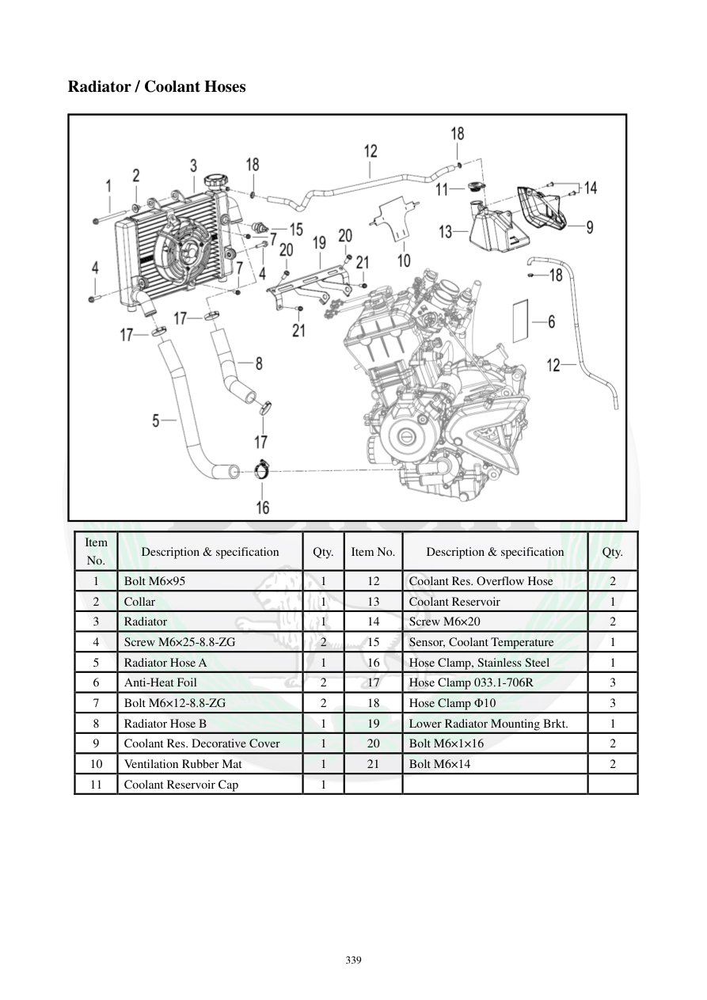

# Manual page 340

> Source: [page-0340.md](../source/page-0340.md)

## Page image / diagram

- [page-0340-img-02.png](../images/embedded/page-0340-img-02.png)

## Extracted text

# Source page 340

 
339 
Radiator / Coolant Hoses 
 
Item 
No. 
Description & specification 
Qty. 
Item No. 
Description & specification 
Qty. 
1 
Bolt M6×95 
1 
12 
Coolant Res. Overflow Hose 
2 
2 
Collar 
1 
13 
Coolant Reservoir 
1 
3 
Radiator 
1 
14 
Screw M6×20 
2 
4 
Screw M6×25-8.8-ZG 
2 
15 
Sensor, Coolant Temperature 
1 
5 
Radiator Hose A 
1 
16 
Hose Clamp, Stainless Steel 
1 
6 
Anti-Heat Foil 
2 
17 
Hose Clamp 033.1-706R 
3 
7 
Bolt M6×12-8.8-ZG 
2 
18 
Hose Clamp Φ10 
3 
8 
Radiator Hose B 
1 
19 
Lower Radiator Mounting Brkt. 
1 
9 
Coolant Res. Decorative Cover 
1 
20 
Bolt M6×1×16 
2 
10 
Ventilation Rubber Mat 
1 
21 
Bolt M6×14 
2 
11 
Coolant Reservoir Cap 
1

## Persian notes

### اجزای رادیاتور و مدار مخزن ذخیره
قطعات اصلی این مجموعه شامل:
- رادیاتور
- شلنگ‌های رادیاتور A و B
- مخزن ذخیره مایع خنک‌کننده و درپوش آن
- شلنگ سرریز مخزن
- سنسور دمای مایع خنک‌کننده
- بست‌های شلنگ
- براکت پایینی رادیاتور
- ورق عایق حرارتی و لاستیک تهویه
- پیچ‌های مختلف از جمله **M6×95، M6×25، M6×20، M6×16 و M6×14**.
این صفحه بیشتر برای شناسایی قطعات و تطبیق آنها با شکل انفجاری استفاده می‌شود.
