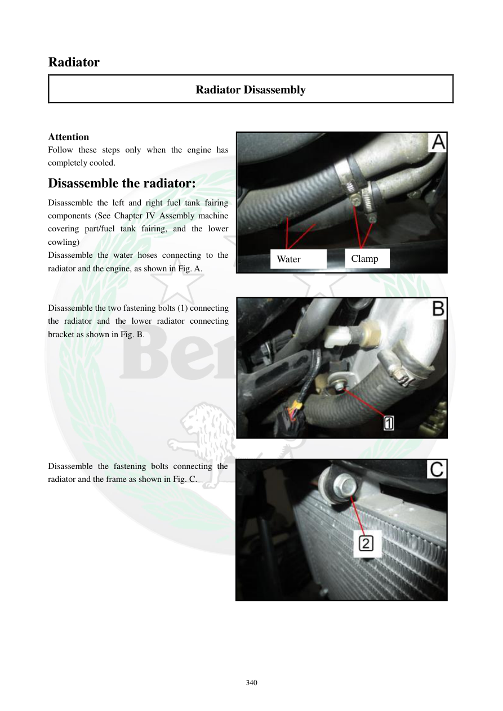

# Manual page 341

> Source: [page-0341.md](../source/page-0341.md)

## Page image / diagram

- [page-0341-img-01.jpeg](../images/embedded/page-0341-img-01.jpeg)

- [page-0341-img-02.jpeg](../images/embedded/page-0341-img-02.jpeg)

- [page-0341-img-03.jpeg](../images/embedded/page-0341-img-03.jpeg)

## Extracted text

# Source page 341

 
340 
Radiator 
Radiator Disassembly 
 
 
Attention 
Follow these steps only when the engine has 
completely cooled. 
Disassemble the radiator: 
Disassemble the left and right fuel tank fairing 
components (See Chapter IV Assembly machine 
covering part/fuel tank fairing, and the lower 
cowling) 
Disassemble the water hoses connecting to the 
radiator and the engine, as shown in Fig. A.  
 
 
Disassemble the two fastening bolts (1) connecting 
the radiator and the lower radiator connecting 
bracket as shown in Fig. B.  
 
 
 
 
 
 
 
 
 
Disassemble the fastening bolts connecting the 
radiator and the frame as shown in Fig. C.  
 
 
 
 
 
 
 
 
 
 
 
 
Water 
Clamp

## Persian notes

### باز کردن رادیاتور
- فقط زمانی کار کنید که **موتور کاملاً سرد شده باشد**.
- قاب‌های چپ و راست اطراف باک باز شوند.
- شلنگ‌های آب متصل به رادیاتور و موتور جدا شوند.
- دو پیچ اتصال رادیاتور به براکت پایینی باز شوند.
- سپس پیچ‌های اتصال رادیاتور به فریم باز و رادیاتور خارج شود.
- هنگام جدا کردن شلنگ‌ها، مایع خنک‌کننده باقی‌مانده می‌تواند خارج شود؛ ظرف مناسب زیر محل قرار دهید.
