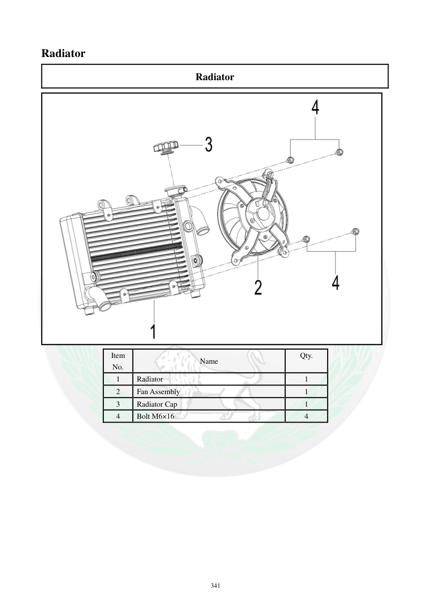

# Manual page 342

> Source: [page-0342.md](../source/page-0342.md)

## Page image / diagram

- [page-0342-img-02.png](../images/embedded/page-0342-img-02.png)

## Extracted text

# Source page 342

 
341 
Radiator 
Radiator 
 
Item 
No. 
Name 
Qty. 
 
1 
Radiator 
1 
2 
Fan Assembly 
1 
3 
Radiator Cap 
1 
4 
Bolt M6×16 
4

## Persian notes

### اجزای مجموعه رادیاتور
مجموعه اصلی شامل:
- **رادیاتور**
- **مجموعه فن**
- **درپوش رادیاتور**
- چهار پیچ **M6×16**
این صفحه نمای کلی مجموعه را نشان می‌دهد و برای تطبیق قطعات هنگام باز و بست مرجع تصویری است.
