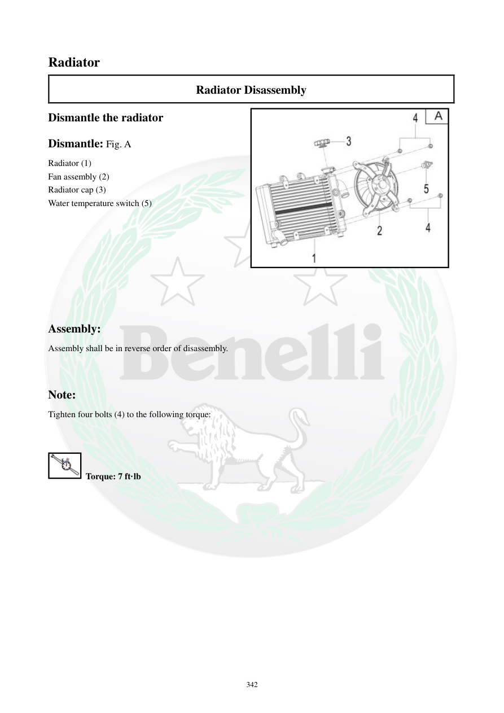

# Manual page 343

> Source: [page-0343.md](../source/page-0343.md)

## Page image / diagram

- [page-0343-img-02.jpeg](../images/embedded/page-0343-img-02.jpeg)

## Extracted text

# Source page 343

 
342 
Radiator 
Radiator Disassembly 
Dismantle the radiator 
Dismantle: Fig. A 
Radiator (1) 
Fan assembly (2) 
Radiator cap (3) 
Water temperature switch (5) 
 
 
 
 
 
 
 
 
Assembly: 
Assembly shall be in reverse order of disassembly. 
 
 
Note: 
Tighten four bolts (4) to the following torque: 
 
 
 Torque: 7 ft·lb

## Persian notes

### باز کردن و مونتاژ رادیاتور
- برای بازکردن، رادیاتور، مجموعه فن، درپوش رادیاتور و **Water Temperature Switch** طبق شکل جدا می‌شوند.
- مونتاژ در ترتیب معکوس بازکردن انجام شود.
- گشتاور چهار پیچ مشخص‌شده: **7 ft·lb**.
- پس از مونتاژ، اتصالات شلنگ و آب‌بندی‌ها باید کنترل شوند.
