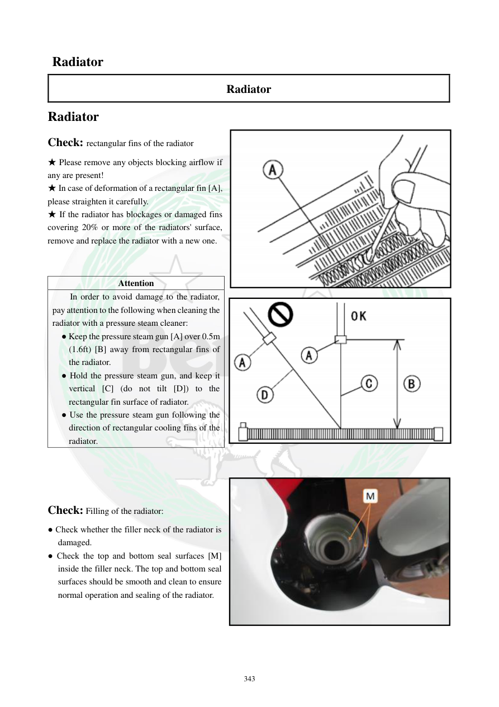

# Manual page 344

> Source: [page-0344.md](../source/page-0344.md)

## Page image / diagram

- [page-0344-img-01.png](../images/embedded/page-0344-img-01.png)

- [page-0344-img-02.png](../images/embedded/page-0344-img-02.png)

- [page-0344-img-03.jpeg](../images/embedded/page-0344-img-03.jpeg)

## Extracted text

# Source page 344

 
343 
 Radiator 
Radiator 
Radiator 
Check: rectangular fins of the radiator 
★ Please remove any objects blocking airflow if 
any are present!  
★ In case of deformation of a rectangular fin [A], 
please straighten it carefully.  
★ If the radiator has blockages or damaged fins 
covering 20% or more of the radiators' surface, 
remove and replace the radiator with a new one. 
 
 
 
 
 
 
Check: Filling of the radiator: 
● Check whether the filler neck of the radiator is 
damaged.  
● Check the top and bottom seal surfaces [M] 
inside the filler neck. The top and bottom seal 
surfaces should be smooth and clean to ensure 
normal operation and sealing of the radiator.  
 
 
 
Attention 
In order to avoid damage to the radiator, 
pay attention to the following when cleaning the 
radiator with a pressure steam cleaner:  
● Keep the pressure steam gun [A] over 0.5m 
(1.6ft) [B] away from rectangular fins of 
the radiator. 
● Hold the pressure steam gun, and keep it 
vertical [C] (do not tilt [D]) to the 
rectangular fin surface of radiator.  
● Use the pressure steam gun following the 
direction of rectangular cooling fins of the 
radiator.

## Persian notes

### بازرسی پره‌ها و گردنه رادیاتور
- پره‌های مستطیلی رادیاتور از نظر گرفتگی با اجسام خارجی بررسی شوند و هر مانع جریان هوا پاک شود.
- پره خم‌شده را با احتیاط صاف کنید.
- اگر گرفتگی یا آسیب پره‌ها **20٪ یا بیشتر از سطح رادیاتور** را درگیر کرده باشد، طبق دفترچه رادیاتور تعویض شود.
- گردنه پرکن رادیاتور و دو سطح آب‌بندی بالا و پایین آن باید سالم، صاف و تمیز باشند.
- در شست‌وشو با بخارشوی پرفشار:
  - نازل حداقل **0.5 m** از پره‌ها فاصله داشته باشد.
  - نازل عمودی نسبت به سطح پره‌ها نگه داشته شود.
  - جهت پاشش مطابق جهت پره‌های خنک‌کننده باشد.
- فشار و حرارت زیاد می‌تواند پره‌های نازک رادیاتور را خم کند.
