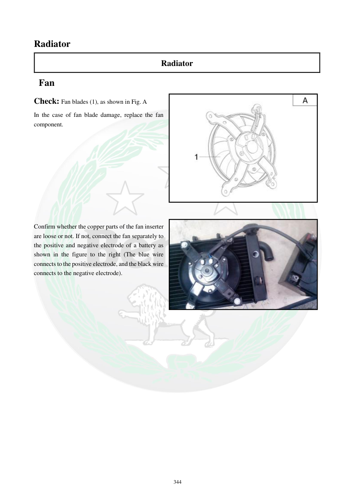

# Manual page 345

> Source: [page-0345.md](../source/page-0345.md)

## Page image / diagram

- [page-0345-img-01.jpeg](../images/embedded/page-0345-img-01.jpeg)

- [page-0345-img-02.jpeg](../images/embedded/page-0345-img-02.jpeg)

## Extracted text

# Source page 345

 
344 
Radiator 
Radiator 
 Fan 
Check: Fan blades (1), as shown in Fig. A 
In the case of fan blade damage, replace the fan 
component.  
 
 
 
 
 
 
 
 
 
 
Confirm whether the copper parts of the fan inserter 
are loose or not. If not, connect the fan separately to 
the positive and negative electrode of a battery as 
shown in the figure to the right (The blue wire 
connects to the positive electrode, and the black wire 
connects to the negative electrode).

## Persian notes

<!-- Persian translation/explanation will be added here. -->
