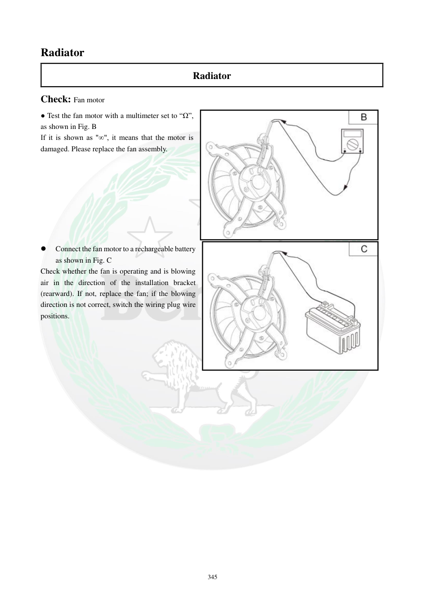

# Manual page 346

> Source: [page-0346.md](../source/page-0346.md)

## Page image / diagram

- [page-0346-img-01.jpeg](../images/embedded/page-0346-img-01.jpeg)

- [page-0346-img-02.jpeg](../images/embedded/page-0346-img-02.jpeg)

## Extracted text

# Source page 346

 
345 
Radiator 
Radiator 
Check: Fan motor 
● Test the fan motor with a multimeter set to “Ω”, 
as shown in Fig. B 
If it is shown as "∞", it means that the motor is 
damaged. Please replace the fan assembly.  
 
 
 
 
 
 
 
 
 
Connect the fan motor to a rechargeable battery 
as shown in Fig. C 
Check whether the fan is operating and is blowing 
air in the direction of the installation bracket 
(rearward). If not, replace the fan; if the blowing 
direction is not correct, switch the wiring plug wire 
positions.

## Persian notes

### تست موتور فن
- موتور فن را با مولتی‌متر روی حالت **Ω** تست کنید.
- اگر دستگاه **∞ (بی‌نهایت)** نشان دهد، طبق دفترچه موتور فن معیوب است و مجموعه فن باید تعویض شود.
- موتور فن را با باتری شارژی طبق شکل تغذیه و بررسی کنید که فن بچرخد و هوا را به سمت **براکت نصب، یعنی عقب** هدایت کند.
- اگر فن کار نمی‌کند، مجموعه فن تعویض شود.
- اگر جهت باد اشتباه است، جای سیم‌های فیش اتصال فن جابه‌جا شود.
- برای تست مستقیم، اتصال کوتاه یا تماس اشتباه سیم‌ها با بدنه/یکدیگر نباید رخ دهد.
