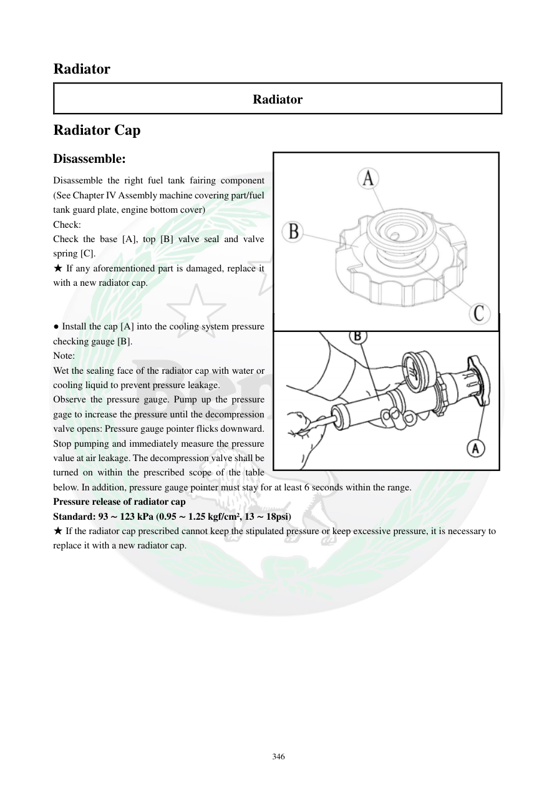

# Manual page 347

> Source: [page-0347.md](../source/page-0347.md)

## Page image / diagram

- [page-0347-img-01.png](../images/embedded/page-0347-img-01.png)

- [page-0347-img-03.jpeg](../images/embedded/page-0347-img-03.jpeg)

## Extracted text

# Source page 347

 
346 
Radiator 
Radiator 
Radiator Cap 
Disassemble: 
Disassemble the right fuel tank fairing component 
(See Chapter IV Assembly machine covering part/fuel 
tank guard plate, engine bottom cover) 
Check: 
Check the base [A], top [B] valve seal and valve 
spring [C].  
★ If any aforementioned part is damaged, replace it 
with a new radiator cap.  
 
 
● Install the cap [A] into the cooling system pressure 
checking gauge [B].  
Note: 
Wet the sealing face of the radiator cap with water or 
cooling liquid to prevent pressure leakage.  
Observe the pressure gauge. Pump up the pressure 
gage to increase the pressure until the decompression 
valve opens: Pressure gauge pointer flicks downward. 
Stop pumping and immediately measure the pressure 
value at air leakage. The decompression valve shall be 
turned on within the prescribed scope of the table 
below. In addition, pressure gauge pointer must stay for at least 6 seconds within the range.  
Pressure release of radiator cap 
Standard: 93 ∼ 123 kPa (0.95 ∼ 1.25 kgf/cm², 13 ∼ 18psi) 
★ If the radiator cap prescribed cannot keep the stipulated pressure or keep excessive pressure, it is necessary to 
replace it with a new radiator cap.

## Persian notes

### تست درپوش رادیاتور
- قاب سمت راست اطراف باک برای دسترسی باز شود.
- پایه، آب‌بندی شیر بالایی، شیر/سوپاپ و فنر درپوش بررسی شوند؛ در صورت آسیب هرکدام، طبق دفترچه **کل درپوش رادیاتور** تعویض شود.
- درپوش روی گیج تست فشار سیستم خنک‌کاری نصب شود.
- سطح آب‌بندی درپوش را با آب یا مایع خنک‌کننده مرطوب کنید تا نشتی کاذب ایجاد نشود.
- فشار را به‌آرامی بالا ببرید تا شیر تخلیه باز شود؛ سپس مقدار فشار را در زمان شروع افت فشار بخوانید.
- فشار عملکرد استاندارد درپوش: **93 تا 123 kPa (0.95 تا 1.25 kgf/cm²، 13 تا 18 psi)**.
- عقربه گیج باید حداقل **6 ثانیه** در محدوده مشخص‌شده باقی بماند.
- اگر درپوش فشار استاندارد را نگه نمی‌دارد یا فشار بیش از حد نگه می‌دارد، تعویض شود.
