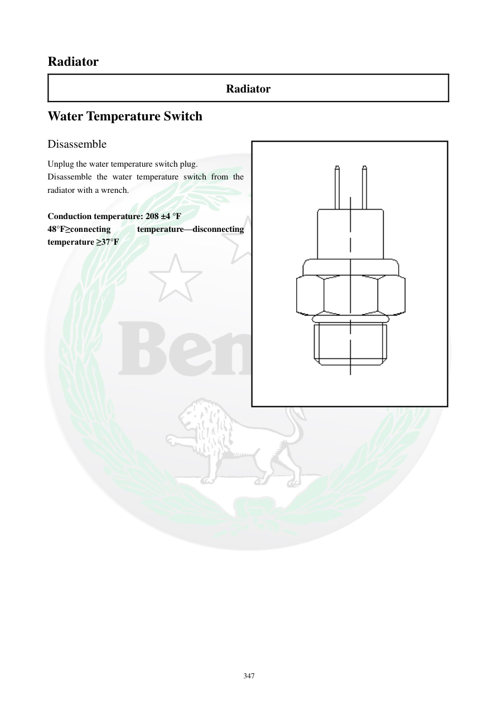

# Manual page 348

> Source: [page-0348.md](../source/page-0348.md)

## Page image / diagram

- [page-0348-img-01.png](../images/embedded/page-0348-img-01.png)

## Extracted text

# Source page 348

 
347 
Radiator 
Radiator 
Water Temperature Switch 
Disassemble 
Unplug the water temperature switch plug. 
Disassemble the water temperature switch from the 
radiator with a wrench.  
 
Conduction temperature: 208 ±4 °F 
48°F≥connecting 
temperature—disconnecting 
temperature ≥37°F

## Persian notes

<!-- Persian translation/explanation will be added here. -->
