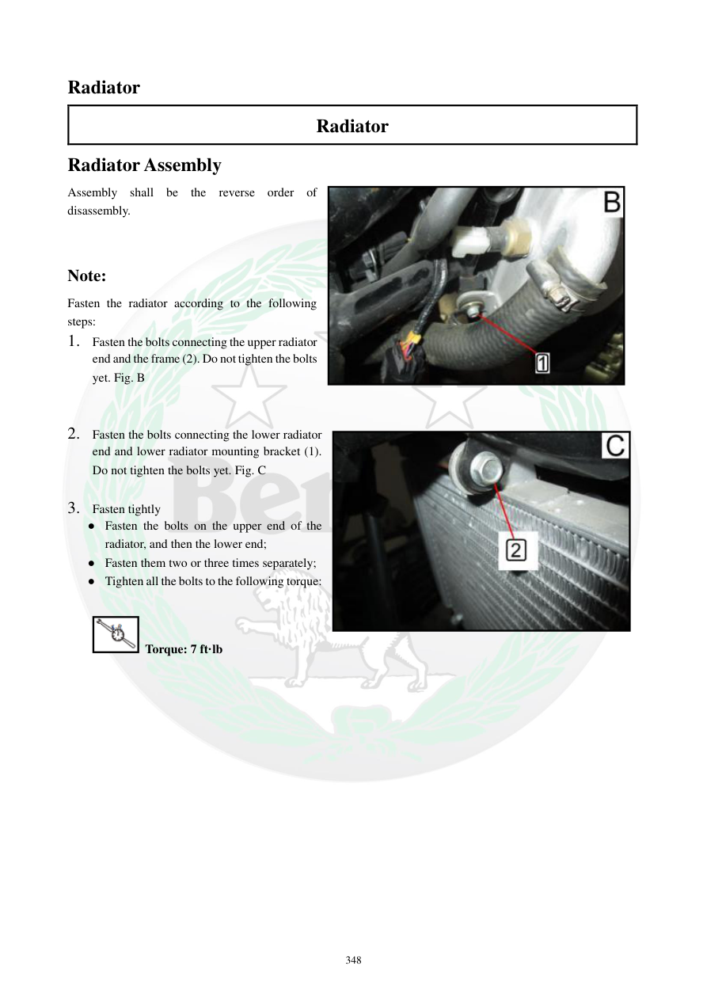

# Manual page 349

> Source: [page-0349.md](../source/page-0349.md)

## Page image / diagram

## Extracted text

# Source page 349

 
348 
Radiator 
Radiator 
Radiator Assembly 
Assembly shall be the reverse order of 
disassembly.  
 
 
Note: 
Fasten the radiator according to the following 
steps: 
1. Fasten the bolts connecting the upper radiator 
end and the frame (2). Do not tighten the bolts 
yet. Fig. B 
 
 
2. Fasten the bolts connecting the lower radiator 
end and lower radiator mounting bracket (1). 
Do not tighten the bolts yet. Fig. C 
 
3. Fasten tightly 
● Fasten the bolts on the upper end of the 
radiator, and then the lower end; 
● Fasten them two or three times separately; 
● Tighten all the bolts to the following torque: 
 
 Torque: 7 ft·lb

## Persian notes

### مونتاژ رادیاتور
- مونتاژ رادیاتور در جهت معکوس بازکردن انجام می‌شود.
- ابتدا پیچ‌های اتصال قسمت بالایی رادیاتور به فریم را ببندید، ولی فعلاً سفت نکنید.
- سپس پیچ‌های قسمت پایینی رادیاتور به براکت پایینی را ببندید، ولی آنها را نیز هنوز سفت نکنید.
- در مرحله نهایی، پیچ‌های قسمت بالا و سپس پایین را در **۲ تا ۳ مرحله** و به‌صورت جداگانه سفت کنید.
- گشتاور نهایی پیچ‌های مشخص‌شده: **7 ft·lb**.
- این ترتیب برای جلوگیری از تحت فشار قرار گرفتن رادیاتور و تنظیم صحیح جای آن روی فریم مهم است.
