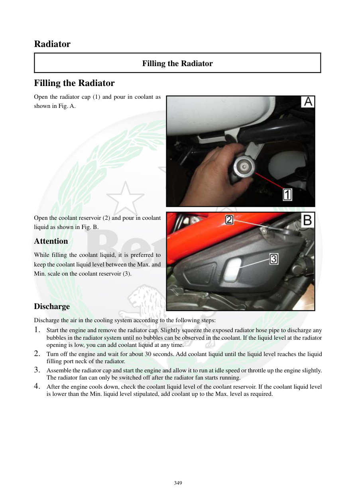

# Manual page 350

> Source: [page-0350.md](../source/page-0350.md)

## Page image / diagram

- [page-0350-img-01.jpeg](../images/embedded/page-0350-img-01.jpeg)

- [page-0350-img-02.jpeg](../images/embedded/page-0350-img-02.jpeg)

## Extracted text

# Source page 350

 
349 
Radiator 
Filling the Radiator 
Filling the Radiator 
Open the radiator cap (1) and pour in coolant as 
shown in Fig. A.  
 
 
 
 
 
 
 
 
 
 
 
Open the coolant reservoir (2) and pour in coolant 
liquid as shown in Fig. B.  
Attention 
While filling the coolant liquid, it is preferred to 
keep the coolant liquid level between the Max. and 
Min. scale on the coolant reservoir (3).   
 
 
Discharge 
Discharge the air in the cooling system according to the following steps: 
1. Start the engine and remove the radiator cap. Slightly squeeze the exposed radiator hose pipe to discharge any 
bubbles in the radiator system until no bubbles can be observed in the coolant. If the liquid level at the radiator 
opening is low, you can add coolant liquid at any time.  
2. Turn off the engine and wait for about 30 seconds. Add coolant liquid until the liquid level reaches the liquid 
filling port neck of the radiator.  
3. Assemble the radiator cap and start the engine and allow it to run at idle speed or throttle up the engine slightly. 
The radiator fan can only be switched off after the radiator fan starts running.      
4. After the engine cools down, check the coolant liquid level of the coolant reservoir. If the coolant liquid level 
is lower than the Min. liquid level stipulated, add coolant up to the Max. level as required.

## Persian notes

### پر کردن و هواگیری سیستم خنک‌کاری
- ابتدا درپوش رادیاتور را باز کرده و مایع خنک‌کننده مناسب اضافه کنید.
- مخزن ذخیره را نیز پر کنید و سطح آن را بین **MIN و MAX** نگه دارید.
- برای هواگیری:
  1. موتور را روشن کنید و با رعایت احتیاط، درپوش رادیاتور را بردارید. شلنگ رادیاتور را به‌آرامی فشار دهید تا حباب‌ها خارج شوند؛ در صورت پایین آمدن سطح، مایع اضافه کنید.
  2. موتور را خاموش کنید و حدود **30 ثانیه** صبر کنید؛ سپس سطح رادیاتور را تا گردنه ورودی تکمیل کنید.
  3. درپوش را نصب کنید، موتور را روشن و در حالت دور آرام یا کمی بالاتر نگه دارید تا **فن رادیاتور شروع به کار کند**.
  4. پس از سردشدن کامل موتور، سطح مخزن ذخیره را دوباره بررسی کنید. اگر پایین‌تر از MIN بود تا MAX پر کنید.
- کار با درپوش باز روی موتور داغ خطر سوختگی دارد؛ این بخش باید با احتیاط بسیار زیاد انجام شود.
