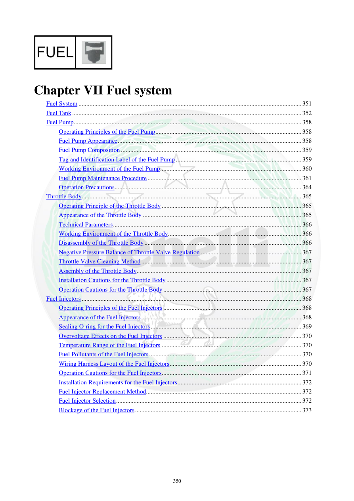

# Manual page 351

> Source: [page-0351.md](../source/page-0351.md)

## Page image / diagram

## Extracted text

# Source page 351

 
350 
 
 
Chapter VII Fuel system 
Fuel System .............................................................................................................................................. 351 
Fuel Tank .................................................................................................................................................. 352 
Fuel Pump ................................................................................................................................................. 358 
Operating Principles of the Fuel Pump ............................................................................................. 358 
Fuel Pump Appearance ..................................................................................................................... 358 
Fuel Pump Composition ................................................................................................................... 359 
Tag and Identification Label of the Fuel Pump ................................................................................ 359 
Working Environment of the Fuel Pump .......................................................................................... 360 
Fuel Pump Maintenance Procedure .................................................................................................. 361 
Operation Precautions ....................................................................................................................... 364 
Throttle Body ............................................................................................................................................ 365 
Operating Principle of the Throttle Body ......................................................................................... 365 
Appearance of the Throttle Body ..................................................................................................... 365 
Technical Parameters ........................................................................................................................ 366 
Working Environment of the Throttle Body ..................................................................................... 366 
Disassembly of the Throttle Body .................................................................................................... 366 
Negative Pressure Balance of Throttle Valve Regulation ................................................................ 367 
Throttle Valve Cleaning Method ...................................................................................................... 367 
Assembly of the Throttle Body ......................................................................................................... 367 
Installation Cautions for the Throttle Body ...................................................................................... 367 
Operation Cautions for the Throttle Body ........................................................................................ 367 
Fuel Injectors ............................................................................................................................................ 368 
Operating Principles of the Fuel Injectors ........................................................................................ 368 
Appearance of the Fuel Injectors ...................................................................................................... 368 
Sealing O-ring for the Fuel Injectors ................................................................................................ 369 
Overvoltage Effects on the Fuel Injectors ........................................................................................ 370 
Temperature Range of the Fuel Injectors ......................................................................................... 370 
Fuel Pollutants of the Fuel Injectors ................................................................................................. 370 
Wiring Harness Layout of the Fuel Injectors .................................................................................... 370 
Operation Cautions for the Fuel Injectors ......................................................................................... 371 
Installation Requirements for the Fuel Injectors ............................................................................... 372 
Fuel Injector Replacement Method................................................................................................... 372 
Fuel Injector Selection ...................................................................................................................... 372 
Blockage of the Fuel Injectors .......................................................................................................... 373

## Persian notes

<!-- Persian translation/explanation will be added here. -->
