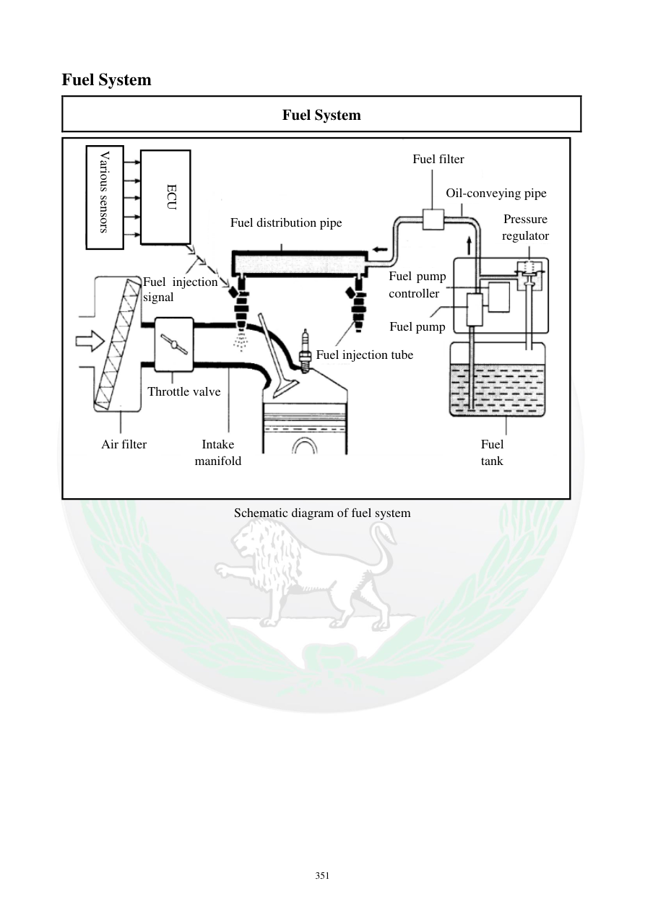

# Manual page 352

> Source: [page-0352.md](../source/page-0352.md)

## Page image / diagram

- [page-0352-img-01.png](../images/embedded/page-0352-img-01.png)

## Extracted text

# Source page 352

 
351 
Fuel System 
Fuel System 
 
Schematic diagram of fuel system 
 
 
 
Various sensors 
ECU 
Fuel distribution pipe 
Fuel filter 
Oil-conveying pipe 
Pressure 
regulator 
Fuel injection 
signal 
Throttle valve 
Air filter 
Intake 
manifold 
Fuel injection tube 
Fuel pump 
Fuel 
tank 
Fuel pump
controller

## Persian notes

### شماتیک سیستم سوخت‌رسانی
مسیر کلی نشان‌داده‌شده در شکل:
**باک → پمپ بنزین → فیلتر سوخت → مسیر/ریل توزیع سوخت → انژکتورها → منیفولد ورودی**
اجزای کنترلی و مرتبط:
- ECU
- سنسورهای مختلف
- دریچه گاز
- فیلتر هوا
- رگولاتور فشار
- Fuel Pump Controller
- لوله‌های سوخت و مسیر تزریق
- برای عیب‌یابی، این صفحه دید کلی از ارتباط اجزای سیستم می‌دهد؛ مسیر دقیق شلنگ‌ها و اتصالات را باید با تصویر همین صفحه تطبیق داد.
