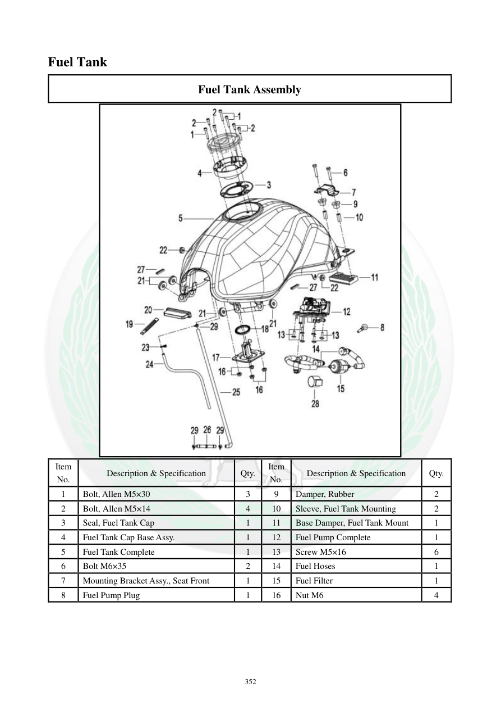

# Manual page 353

> Source: [page-0353.md](../source/page-0353.md)

## Page image / diagram

- [page-0353-img-01.jpeg](../images/embedded/page-0353-img-01.jpeg)

## Extracted text

# Source page 353

 
352 
Fuel Tank 
Fuel Tank Assembly 
 
Item 
No. 
Description & Specification 
Qty. 
Item 
No. 
Description & Specification 
Qty. 
1 
Bolt, Allen M5×30 
3 
9 
Damper, Rubber 
2 
2 
Bolt, Allen M5×14 
4 
10 
Sleeve, Fuel Tank Mounting 
2 
3 
Seal, Fuel Tank Cap 
1 
11 
Base Damper, Fuel Tank Mount 
1 
4 
Fuel Tank Cap Base Assy. 
1 
12 
Fuel Pump Complete 
1 
5 
Fuel Tank Complete 
1 
13 
Screw M5×16 
6 
6 
Bolt M6×35 
2 
14 
Fuel Hoses 
1 
7 
Mounting Bracket Assy., Seat Front 
1 
15 
Fuel Filter  
1 
8 
Fuel Pump Plug 
1 
16 
Nut M6 
4

## Persian notes

### اجزای مجموعه باک
قطعات اصلی مجموعه باک:
- خود **Fuel Tank**
- مجموعه پایه درپوش باک و آب‌بندی آن
- پمپ بنزین کامل
- شلنگ‌های سوخت
- فیلتر سوخت
- سنسور سطح سوخت
- سوکت پمپ
- لرزه‌گیرها و بوش‌های نصب باک
- براکت جلوی صندلی
- پیچ‌ها و مهره‌های نصب
- پیچ‌های اصلی نشان‌داده‌شده شامل **M5×30، M5×14، M6×35 و M5×16**.
این صفحه برای شناسایی قطعات و تطبیق آنها هنگام باز و بست باک مرجع تصویری است.
