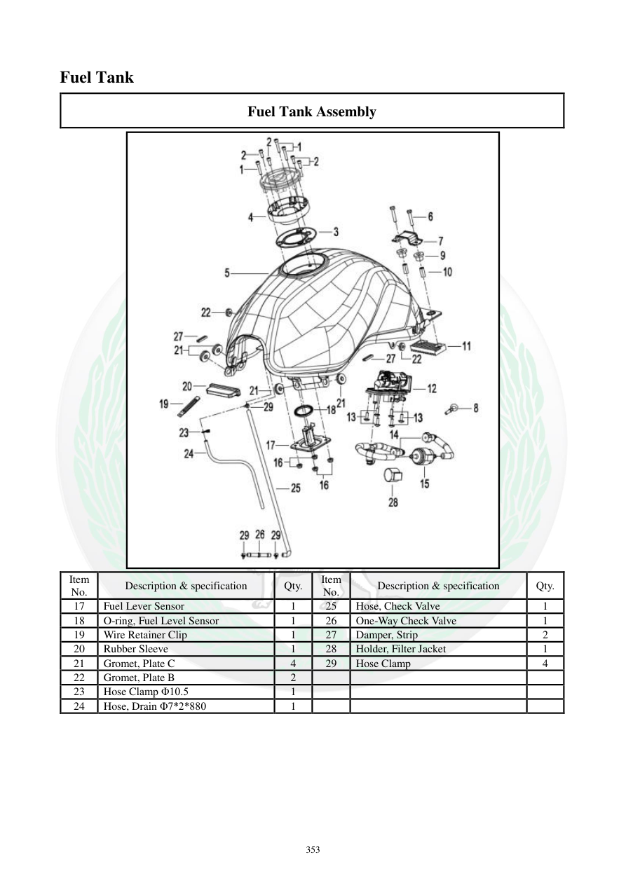

# Manual page 354

> Source: [page-0354.md](../source/page-0354.md)

## Page image / diagram

- [page-0354-img-01.jpeg](../images/embedded/page-0354-img-01.jpeg)

## Extracted text

# Source page 354

 
353 
Fuel Tank 
Fuel Tank Assembly 
 
Item 
No. 
Description & specification 
Qty. 
Item 
No. 
Description & specification 
Qty. 
17 
Fuel Lever Sensor 
1 
25 
Hose, Check Valve  
1 
18 
O-ring, Fuel Level Sensor 
1 
26 
One-Way Check Valve 
1 
19 
Wire Retainer Clip 
1 
27 
Damper, Strip 
2 
20 
Rubber Sleeve 
1 
28 
Holder, Filter Jacket 
1 
21 
Gromet, Plate C 
4 
29 
Hose Clamp 
4 
22 
Gromet, Plate B 
2 
 
 
 
23 
Hose Clamp Φ10.5 
1 
 
 
 
24 
Hose, Drain Φ7*2*880 
1

## Persian notes

### ادامه اجزای مجموعه باک
قطعات تکمیلی شامل:
- سنسور سطح سوخت و **O-ring** آن
- گیره نگهدارنده سیم
- بوش لاستیکی
- Grommetهای صفحه
- شلنگ تخلیه با مشخصات **Φ7×2×880**
- شیر یک‌طرفه (One-Way Check Valve)
- شلنگ مربوط به Check Valve
- بست‌های شلنگ، از جمله بست **Φ10.5**
- نوار/لایه لاستیکی و نگهدارنده فیلتر
این صفحه همراه صفحه 353 برای شناسایی کامل قطعات مجموعه باک استفاده شود.
