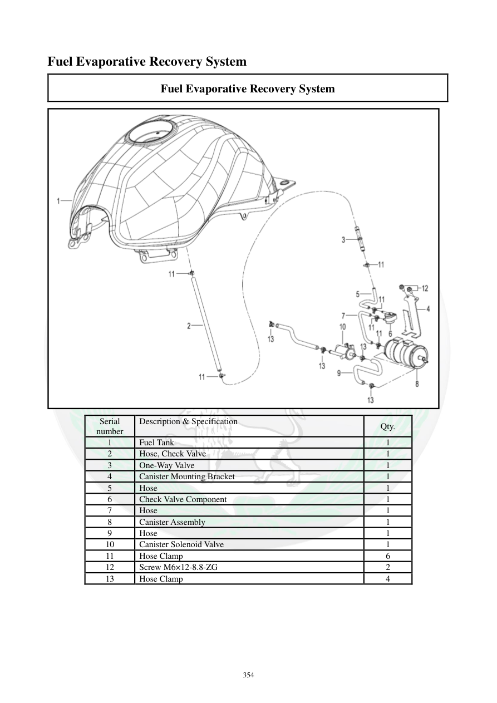

# Manual page 355

> Source: [page-0355.md](../source/page-0355.md)

## Page image / diagram

- [page-0355-img-02.png](../images/embedded/page-0355-img-02.png)

## Extracted text

# Source page 355

 
354 
Fuel Evaporative Recovery System 
Fuel Evaporative Recovery System 
 
Serial 
number 
Description & Specification 
 
Qty. 
1 
Fuel Tank 
1 
2 
Hose, Check Valve 
1 
3 
One-Way Valve 
1 
4 
Canister Mounting Bracket 
1 
5 
Hose 
1 
6 
Check Valve Component 
1 
7 
Hose 
1 
8 
Canister Assembly 
1 
9 
Hose 
1 
10 
Canister Solenoid Valve 
1 
11 
Hose Clamp 
6 
12 
Screw M6×12-8.8-ZG 
2 
13 
Hose Clamp 
4

## Persian notes

<!-- Persian translation/explanation will be added here. -->
