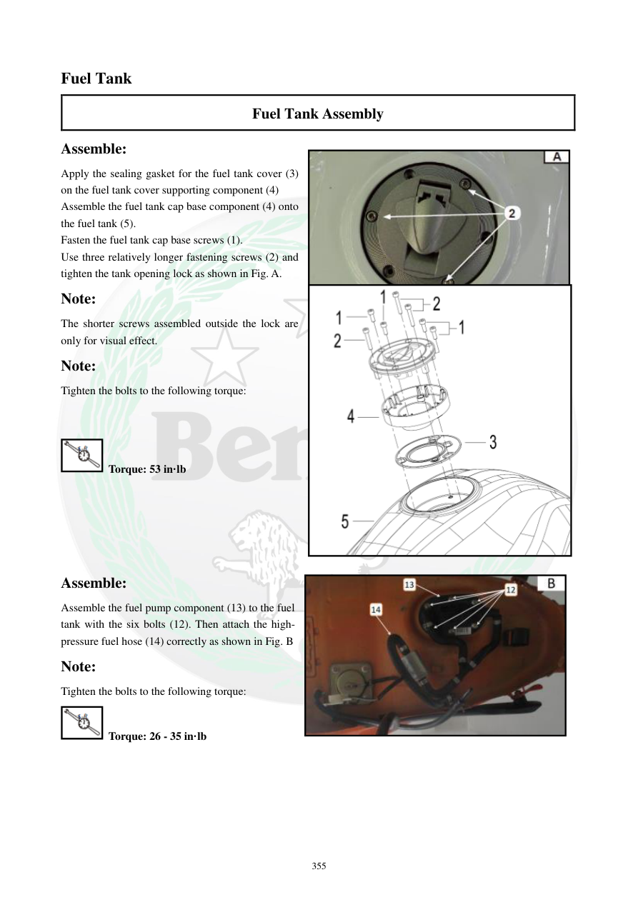

# Manual page 356

> Source: [page-0356.md](../source/page-0356.md)

## Page image / diagram

- [page-0356-img-02.jpeg](../images/embedded/page-0356-img-02.jpeg)

- [page-0356-img-03.jpeg](../images/embedded/page-0356-img-03.jpeg)

- [page-0356-img-05.png](../images/embedded/page-0356-img-05.png)

## Extracted text

# Source page 356

 
355 
Fuel Tank 
Fuel Tank Assembly 
Assemble: 
Apply the sealing gasket for the fuel tank cover (3) 
on the fuel tank cover supporting component (4) 
Assemble the fuel tank cap base component (4) onto 
the fuel tank (5).  
Fasten the fuel tank cap base screws (1). 
Use three relatively longer fastening screws (2) and 
tighten the tank opening lock as shown in Fig. A.  
Note: 
The shorter screws assembled outside the lock are 
only for visual effect.  
Note: 
Tighten the bolts to the following torque: 
 
 
 Torque: 53 in·lb 
 
 
 
 
 
Assemble: 
Assemble the fuel pump component (13) to the fuel 
tank with the six bolts (12). Then attach the high-
pressure fuel hose (14) correctly as shown in Fig. B 
Note: 
Tighten the bolts to the following torque: 
 Torque: 26 - 35 in·lb

## Persian notes

### مونتاژ پایه درپوش باک و پمپ بنزین
- واشر آب‌بندی پایه درپوش باک روی قطعه نگهدارنده نصب شود.
- پایه درپوش روی باک قرار گرفته و پیچ‌های آن بسته شوند.
- سه پیچ بلندتر طبق شکل برای قفل دهانه باک استفاده می‌شوند؛ پیچ‌های کوتاه بیرونی طبق دفترچه جنبه ظاهری دارند.
- گشتاور پیچ‌های پایه درپوش: **53 in·lb**.
- مجموعه پمپ بنزین با **6 پیچ** روی باک نصب می‌شود.
- شلنگ سوخت پرفشار باید دقیقاً طبق شکل متصل شود.
- گشتاور پیچ‌های پمپ: **26 تا 35 in·lb**.
- ترتیب و جهت قرارگیری شلنگ پرفشار را از تصویر صفحه کنترل کنید.
