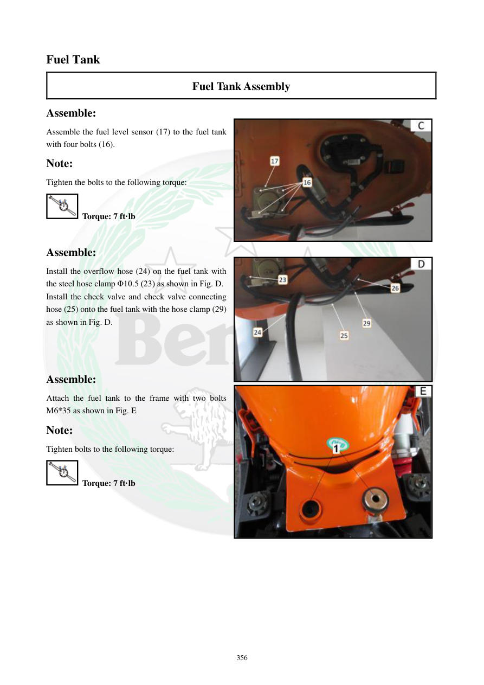

# Manual page 357

> Source: [page-0357.md](../source/page-0357.md)

## Page image / diagram

- [page-0357-img-02.jpeg](../images/embedded/page-0357-img-02.jpeg)

- [page-0357-img-03.jpeg](../images/embedded/page-0357-img-03.jpeg)

- [page-0357-img-04.jpeg](../images/embedded/page-0357-img-04.jpeg)

## Extracted text

# Source page 357

 
356 
Fuel Tank 
Fuel Tank Assembly 
Assemble: 
Assemble the fuel level sensor (17) to the fuel tank 
with four bolts (16).  
Note: 
Tighten the bolts to the following torque: 
 Torque: 7 ft·lb 
 
Assemble: 
Install the overflow hose (24) on the fuel tank with 
the steel hose clamp Φ10.5 (23) as shown in Fig. D.  
Install the check valve and check valve connecting 
hose (25) onto the fuel tank with the hose clamp (29) 
as shown in Fig. D.  
 
 
 
Assemble: 
Attach the fuel tank to the frame with two bolts 
M6*35 as shown in Fig. E 
Note: 
Tighten bolts to the following torque: 
 Torque: 7 ft·lb

## Persian notes

### نصب سنسور سطح سوخت، شلنگ‌ها و باک
- سنسور سطح سوخت با چهار پیچ نصب می‌شود؛ گشتاور: **7 ft·lb**.
- شلنگ سرریز با بست فلزی **Φ10.5** روی باک نصب شود.
- Check Valve و شلنگ اتصال آن با بست مشخص‌شده نصب شوند؛ جهت شیر را طبق شکل رعایت کنید.
- باک با دو پیچ **M6×35** به فریم متصل می‌شود.
- گشتاور پیچ‌های اتصال باک به فریم: **7 ft·lb**.
- پس از مونتاژ، مسیر شلنگ‌ها و سیم‌ها نباید تحت کشش، تاخوردگی یا گیرکردن بین قطعات قرار گرفته باشد.
