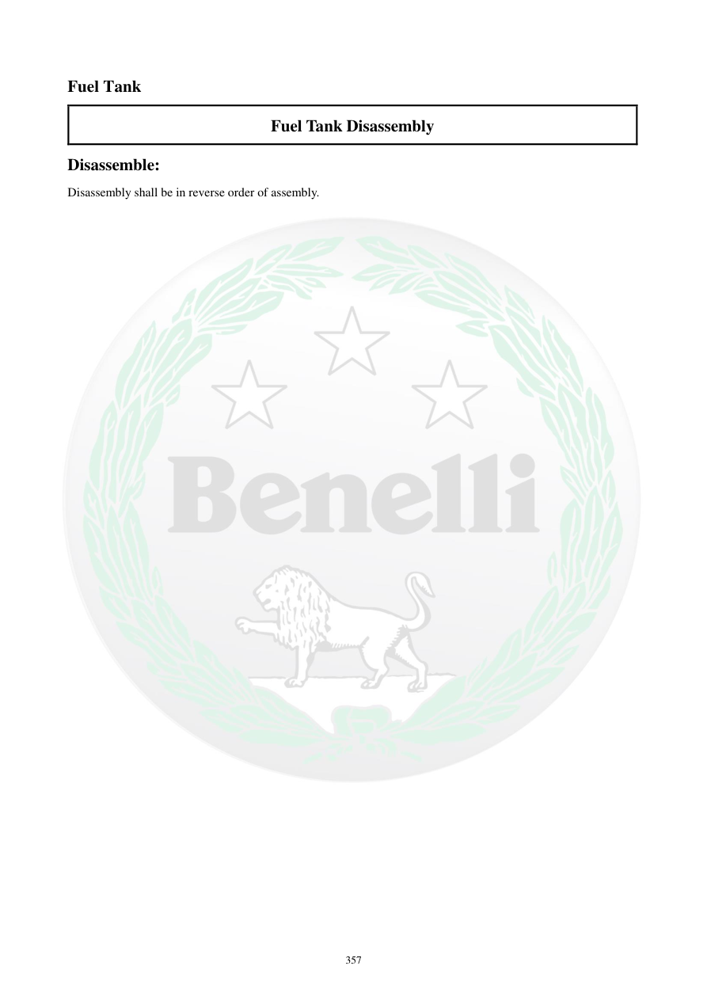

# Manual page 358

> Source: [page-0358.md](../source/page-0358.md)

## Page image / diagram

## Extracted text

# Source page 358

 
357 
Fuel Tank 
Fuel Tank Disassembly 
Disassemble: 
Disassembly shall be in reverse order of assembly.

## Persian notes

### باز کردن باک
- بازکردن مجموعه باک باید **در ترتیب معکوس مونتاژ** انجام شود.
- برای جزئیات ترتیب قطعات و پیچ‌ها به صفحات 353 تا 357 و تصاویر همان صفحات مراجعه شود.
- هنگام بازکردن باک، رعایت نکات ایمنی سوخت و تخلیه/کاهش فشار سیستم ضروری است.
