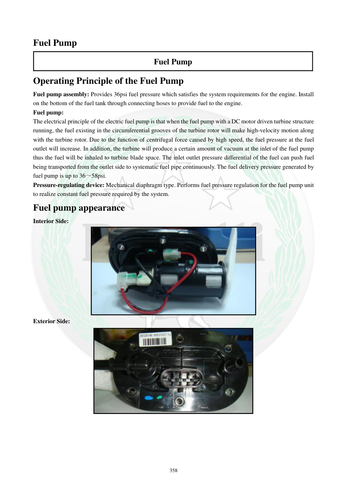

# Manual page 359

> Source: [page-0359.md](../source/page-0359.md)

## Page image / diagram

- [page-0359-img-01.jpeg](../images/embedded/page-0359-img-01.jpeg)

- [page-0359-img-02.jpeg](../images/embedded/page-0359-img-02.jpeg)

## Extracted text

# Source page 359

 
358 
Fuel Pump 
Fuel Pump 
Operating Principle of the Fuel Pump 
Fuel pump assembly: Provides 36psi fuel pressure which satisfies the system requirements for the engine. Install 
on the bottom of the fuel tank through connecting hoses to provide fuel to the engine.  
Fuel pump: 
The electrical principle of the electric fuel pump is that when the fuel pump with a DC motor driven turbine structure 
running, the fuel existing in the circumferential grooves of the turbine rotor will make high-velocity motion along 
with the turbine rotor. Due to the function of centrifugal force caused by high speed, the fuel pressure at the fuel 
outlet will increase. In addition, the turbine will produce a certain amount of vacuum at the inlet of the fuel pump 
thus the fuel will be inhaled to turbine blade space. The inlet outlet pressure differential of the fuel can push fuel 
being transported from the outlet side to systematic fuel pipe continuously. The fuel delivery pressure generated by 
fuel pump is up to 36～58psi.  
Pressure-regulating device: Mechanical diaphragm type. Performs fuel pressure regulation for the fuel pump unit 
to realize constant fuel pressure required by the system.  
Fuel pump appearance 
Interior Side: 
 
Exterior Side:

## Persian notes

### پمپ بنزین و فشار سوخت
- مجموعه پمپ بنزین برای تأمین فشار موردنیاز سیستم طراحی شده و متن دفترچه فشار اسمی را **36 psi** ذکر می‌کند.
- در توضیح عملکرد، فشار ایجادشده توسط پمپ تا **36 تا 58 psi** ذکر شده است. این دو عدد مربوط به دو بیان متفاوت در متن هستند و نباید بدون بررسی مدار/شرایط تست یکی فرض شوند.
- پمپ از یک موتور DC و ساختار توربینی استفاده می‌کند؛ چرخش توربین باعث افزایش فشار در خروجی و مکش سوخت از ورودی می‌شود.
- رگولاتور فشار از نوع **دیافراگمی مکانیکی** است و وظیفه تنظیم فشار سوخت سیستم را دارد.
- برای مقادیر عملی عیب‌یابی، صفحه 362 محدوده فشار جلوی انژکتور را ارائه می‌کند.
