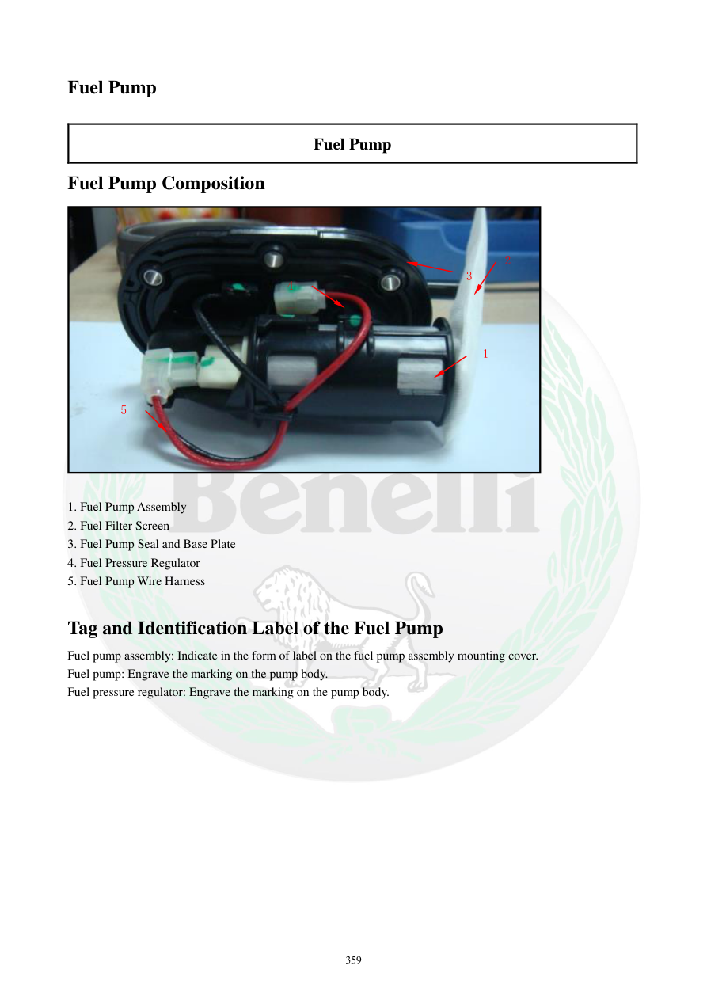

# Manual page 360

> Source: [page-0360.md](../source/page-0360.md)

## Page image / diagram

- [page-0360-img-01.jpeg](../images/embedded/page-0360-img-01.jpeg)

## Extracted text

# Source page 360

 
359 
Fuel Pump 
 
Fuel Pump 
Fuel Pump Composition 
 
 
1. Fuel Pump Assembly 
2. Fuel Filter Screen 
3. Fuel Pump Seal and Base Plate 
4. Fuel Pressure Regulator 
5. Fuel Pump Wire Harness 
 
Tag and Identification Label of the Fuel Pump 
Fuel pump assembly: Indicate in the form of label on the fuel pump assembly mounting cover.  
Fuel pump: Engrave the marking on the pump body.  
Fuel pressure regulator: Engrave the marking on the pump body.  
 
 
 
3 
1
2 
4 
5

## Persian notes

### اجزای پمپ بنزین
اجزای اصلی:
1. مجموعه پمپ بنزین
2. توری فیلتر سوخت
3. آب‌بندی پمپ و صفحه پایه
4. رگولاتور فشار سوخت
5. دسته‌سیم پمپ
- مشخصات و برچسب شناسایی روی کاور نصب مجموعه پمپ درج می‌شود و خود پمپ و رگولاتور نیز علامت‌گذاری دارند.
- برای بازکردن یا تعمیر، جهت و جای قطعات را با تصویر صفحه تطبیق دهید.
