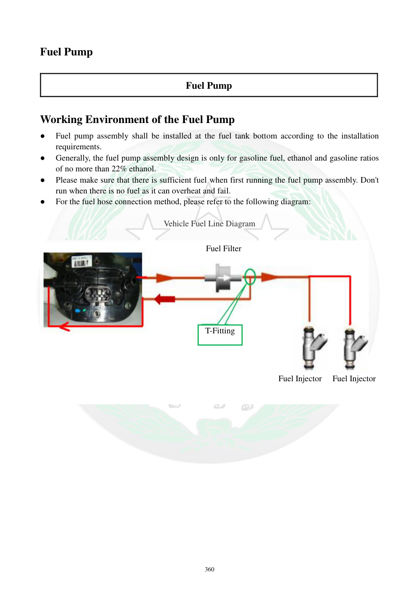

# Manual page 361

> Source: [page-0361.md](../source/page-0361.md)

## Page image / diagram

- [page-0361-img-01.jpeg](../images/embedded/page-0361-img-01.jpeg)

## Extracted text

# Source page 361

 
360 
Fuel Pump 
 
Fuel Pump 
 
Working Environment of the Fuel Pump 
● 
Fuel pump assembly shall be installed at the fuel tank bottom according to the installation 
requirements.  
● 
Generally, the fuel pump assembly design is only for gasoline fuel, ethanol and gasoline ratios 
of no more than 22% ethanol.      
● 
Please make sure that there is sufficient fuel when first running the fuel pump assembly. Don't 
run when there is no fuel as it can overheat and fail.  
● 
For the fuel hose connection method, please refer to the following diagram: 
 
Vehicle Fuel Line Diagram 
 
 
 
 
Fuel Filter 
T-Fitting 
Fuel Injector 
Fuel Injector

## Persian notes

<!-- Persian translation/explanation will be added here. -->
