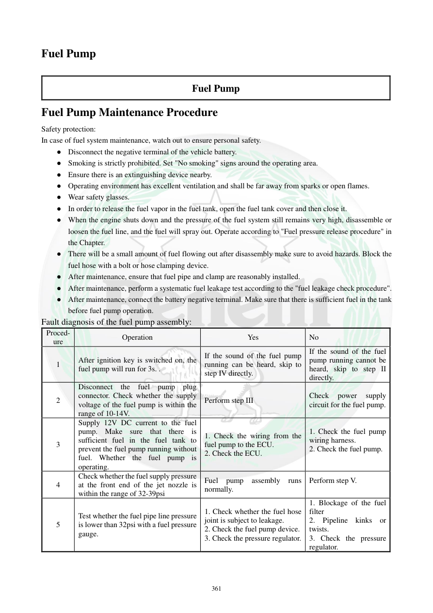

# Manual page 362

> Source: [page-0362.md](../source/page-0362.md)

## Page image / diagram

## Extracted text

# Source page 362

 
361 
Fuel Pump 
 
Fuel Pump 
Fuel Pump Maintenance Procedure 
Safety protection: 
In case of fuel system maintenance, watch out to ensure personal safety.    
● Disconnect the negative terminal of the vehicle battery.  
● Smoking is strictly prohibited. Set "No smoking" signs around the operating area.  
● Ensure there is an extinguishing device nearby.  
● Operating environment has excellent ventilation and shall be far away from sparks or open flames.  
● Wear safety glasses. 
● In order to release the fuel vapor in the fuel tank, open the fuel tank cover and then close it.  
● When the engine shuts down and the pressure of the fuel system still remains very high, disassemble or 
loosen the fuel line, and the fuel will spray out. Operate according to "Fuel pressure release procedure" in 
the Chapter.  
● There will be a small amount of fuel flowing out after disassembly make sure to avoid hazards. Block the 
fuel hose with a bolt or hose clamping device.  
● After maintenance, ensure that fuel pipe and clamp are reasonably installed.  
● After maintenance, perform a systematic fuel leakage test according to the "fuel leakage check procedure".  
● After maintenance, connect the battery negative terminal. Make sure that there is sufficient fuel in the tank 
before fuel pump operation.  
Fault diagnosis of the fuel pump assembly: 
Proced-
ure 
Operation 
Yes 
No 
1 
After ignition key is switched on, the 
fuel pump will run for 3s. . 
If the sound of the fuel pump 
running can be heard, skip to 
step IV directly. 
If the sound of the fuel 
pump running cannot be 
heard, skip to step II 
directly. 
2 
Disconnect the fuel pump plug 
connector. Check whether the supply 
voltage of the fuel pump is within the 
range of 10-14V.   
Perform step III 
Check 
power 
supply 
circuit for the fuel pump. 
3 
Supply 12V DC current to the fuel 
pump. Make sure that there is 
sufficient fuel in the fuel tank to 
prevent the fuel pump running without 
fuel. Whether the fuel pump is 
operating. 
1. Check the wiring from the 
fuel pump to the ECU.  
2. Check the ECU. 
1. Check the fuel pump 
wiring harness. 
2. Check the fuel pump.  
 
4 
Check whether the fuel supply pressure 
at the front end of the jet nozzle is 
within the range of 32-39psi   
Fuel 
pump 
assembly 
runs 
normally. 
Perform step V. 
 
5 
Test whether the fuel pipe line pressure 
is lower than 32psi with a fuel pressure 
gauge.   
1. Check whether the fuel hose 
joint is subject to leakage.   
2. Check the fuel pump device.  
3. Check the pressure regulator. 
1. Blockage of the fuel 
filter 
2. Pipeline kinks or 
twists. 
3. Check the pressure 
regulator.

## Persian notes

### عیب‌یابی پمپ بنزین
**ایمنی:** قبل از کار روی سیستم سوخت، قطب منفی باتری را جدا کنید، سیگار و هر شعله/جرقه را از محیط دور نگه دارید، تهویه مناسب داشته باشید و وسیله اطفای حریق در دسترس باشد.

**تست مرحله‌ای:**
1. با بازکردن سوئیچ، پمپ باید حدود **3 ثانیه** کار کند. صدای پمپ شنیده شد، طبق جدول به مرحله 4 بروید.
2. اگر صدا شنیده نشد، سوکت پمپ را جدا کرده و ولتاژ تغذیه را بررسی کنید: **10 تا 14 V**.
3. با وجود سوخت کافی، تغذیه **12 V DC** مستقیم برای تست پمپ انجام شود. در صورت کار نکردن، سیم‌کشی/خود پمپ بررسی شود؛ در صورت کارکرد، مدار ECU و سیم‌کشی مرتبط بررسی شود.
4. فشار سوخت جلوی انژکتور باید **32 تا 39 psi** باشد.
5. اگر فشار کمتر از **32 psi** است، نشتی اتصال شلنگ، پمپ و رگولاتور بررسی شوند؛ گرفتگی فیلتر و تاخوردگی شلنگ نیز بررسی شود.
- بعد از هر تعمیر سیستم سوخت، تست نشتی الزامی است.
