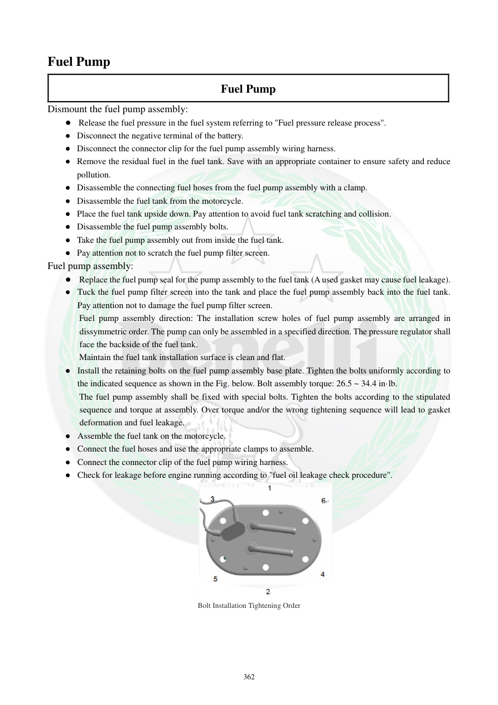

# Manual page 363

> Source: [page-0363.md](../source/page-0363.md)

## Page image / diagram

- [page-0363-img-01.png](../images/embedded/page-0363-img-01.png)

## Extracted text

# Source page 363

 
362 
Fuel Pump 
Fuel Pump 
Dismount the fuel pump assembly: 
● Release the fuel pressure in the fuel system referring to "Fuel pressure release process".  
● Disconnect the negative terminal of the battery.  
● Disconnect the connector clip for the fuel pump assembly wiring harness.  
● Remove the residual fuel in the fuel tank. Save with an appropriate container to ensure safety and reduce 
pollution.  
● Disassemble the connecting fuel hoses from the fuel pump assembly with a clamp.  
● Disassemble the fuel tank from the motorcycle.  
● Place the fuel tank upside down. Pay attention to avoid fuel tank scratching and collision.   
● Disassemble the fuel pump assembly bolts.  
● Take the fuel pump assembly out from inside the fuel tank. 
● Pay attention not to scratch the fuel pump filter screen.  
Fuel pump assembly: 
● Replace the fuel pump seal for the pump assembly to the fuel tank (A used gasket may cause fuel leakage). 
● Tuck the fuel pump filter screen into the tank and place the fuel pump assembly back into the fuel tank. 
Pay attention not to damage the fuel pump filter screen.  
Fuel pump assembly direction: The installation screw holes of fuel pump assembly are arranged in 
dissymmetric order. The pump can only be assembled in a specified direction. The pressure regulator shall 
face the backside of the fuel tank.  
Maintain the fuel tank installation surface is clean and flat.  
● Install the retaining bolts on the fuel pump assembly base plate. Tighten the bolts uniformly according to 
the indicated sequence as shown in the Fig. below. Bolt assembly torque: 26.5 ~ 34.4 in·lb. 
The fuel pump assembly shall be fixed with special bolts. Tighten the bolts according to the stipulated 
sequence and torque at assembly. Over torque and/or the wrong tightening sequence will lead to gasket 
deformation and fuel leakage.  
● Assemble the fuel tank on the motorcycle.  
● Connect the fuel hoses and use the appropriate clamps to assemble.  
● Connect the connector clip of the fuel pump wiring harness.  
● Check for leakage before engine running according to "fuel oil leakage check procedure".  
 
Bolt Installation Tightening Order

## Persian notes

### باز کردن و نصب مجموعه پمپ بنزین
- ابتدا فشار سوخت را طبق روش صفحه 364 تخلیه کنید و قطب منفی باتری را جدا کنید.
- سوکت دسته‌سیم پمپ را جدا و سوخت باقی‌مانده باک را در ظرف مناسب تخلیه کنید.
- شلنگ‌های سوخت را با ابزار/بست مناسب جدا کرده و سپس باک را از موتور جدا کنید.
- باک را با احتیاط برگردانید تا خط و ضربه ایجاد نشود؛ سپس پیچ‌های مجموعه پمپ را باز کنید.
- هنگام بیرون‌آوردن پمپ، **توری فیلتر نباید آسیب ببیند**.
- آب‌بندی مجموعه پمپ هنگام نصب باید **نو** باشد؛ آب‌بندی کارکرده می‌تواند باعث نشتی سوخت شود.
- جهت نصب پمپ نامتقارن است و فقط در جهت مشخص نصب می‌شود؛ طبق متن، **رگولاتور فشار باید رو به قسمت عقب باک** قرار بگیرد.
- سطح نصب باک باید تمیز و صاف باشد.
- پیچ‌های پایه پمپ به‌صورت یکنواخت و طبق ترتیب شکل سفت شوند: **26.5 تا 34.4 in·lb**.
- گشتاور یا ترتیب اشتباه می‌تواند واشر را تغییر شکل داده و باعث نشتی شود.
- پس از اتصال شلنگ‌ها و سوکت، قبل از روشن‌کردن موتور تست نشتی انجام شود.
