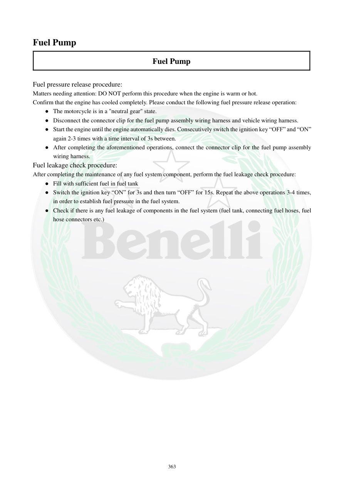

# Manual page 364

> Source: [page-0364.md](../source/page-0364.md)

## Page image / diagram

## Extracted text

# Source page 364

 
363 
Fuel Pump 
Fuel Pump 
 
Fuel pressure release procedure: 
Matters needing attention: DO NOT perform this procedure when the engine is warm or hot.  
Confirm that the engine has cooled completely. Please conduct the following fuel pressure release operation: 
● The motorcycle is in a "neutral gear" state.  
● Disconnect the connector clip for the fuel pump assembly wiring harness and vehicle wiring harness.  
● Start the engine until the engine automatically dies. Consecutively switch the ignition key “OFF” and “ON” 
again 2-3 times with a time interval of 3s between.  
● After completing the aforementioned operations, connect the connector clip for the fuel pump assembly 
wiring harness.  
Fuel leakage check procedure: 
After completing the maintenance of any fuel system component, perform the fuel leakage check procedure:  
● Fill with sufficient fuel in fuel tank 
● Switch the ignition key “ON” for 3s and then turn “OFF” for 15s. Repeat the above operations 3-4 times, 
in order to establish fuel pressure in the fuel system.  
● Check if there is any fuel leakage of components in the fuel system (fuel tank, connecting fuel hoses, fuel 
hose connectors etc.)

## Persian notes

### تخلیه فشار سوخت و تست نشتی
**تخلیه فشار:**
- این کار را روی موتور گرم یا داغ انجام ندهید؛ موتور باید کاملاً سرد باشد.
- موتور در حالت **خلاص** باشد.
- سوکت مجموعه پمپ را از دسته‌سیم خودرو جدا کنید.
- موتور را روشن کنید و اجازه دهید به‌دلیل قطع تغذیه پمپ خودش خاموش شود.
- سپس سوئیچ را با فاصله حدود **3 ثانیه** بین OFF و ON، **2 تا 3 بار** تغییر دهید.
- پس از پایان کار، سوکت پمپ را دوباره وصل کنید.

**تست نشتی پس از تعمیر:**
- باک را به مقدار کافی سوخت‌گیری کنید.
- سوئیچ را **3 ثانیه ON** و **15 ثانیه OFF** کنید و این چرخه را **3 تا 4 بار** تکرار کنید تا فشار سیستم ایجاد شود.
- باک، شلنگ‌ها و اتصالات را از نظر هرگونه نشتی بررسی کنید.
- هیچ‌وقت این مراحل را کنار شعله، جرقه یا منبع حرارت انجام ندهید.
