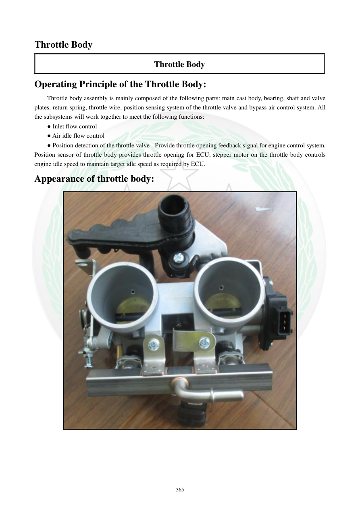

# Manual page 366

> Source: [page-0366.md](../source/page-0366.md)

## Page image / diagram

- [page-0366-img-01.jpeg](../images/embedded/page-0366-img-01.jpeg)

## Extracted text

# Source page 366

 
365 
Throttle Body 
Throttle Body 
Operating Principle of the Throttle Body: 
Throttle body assembly is mainly composed of the following parts: main cast body, bearing, shaft and valve 
plates, return spring, throttle wire, position sensing system of the throttle valve and bypass air control system. All 
the subsystems will work together to meet the following functions: 
● Inlet flow control  
● Air idle flow control 
● Position detection of the throttle valve - Provide throttle opening feedback signal for engine control system.  
Position sensor of throttle body provides throttle opening for ECU; stepper motor on the throttle body controls 
engine idle speed to maintain target idle speed as required by ECU. 
Appearance of throttle body:

## Persian notes

### Throttle Body و وظیفه آن
Throttle Body از بخش‌هایی مانند بدنه، یاتاقان، محور و صفحه دریچه، فنر برگشت، سیم گاز، سنسور موقعیت دریچه و سیستم کنترل هوای بای‌پس تشکیل شده است.
وظایف اصلی:
- کنترل جریان هوای ورودی
- کنترل هوای دور آرام
- تشخیص موقعیت دریچه و ارسال بازخورد به ECU
- سنسور موقعیت، میزان بازشدن دریچه را به ECU اعلام می‌کند.
- استپر موتور روی Throttle Body هوای دور آرام را کنترل می‌کند تا ECU بتواند دور هدف موتور را حفظ کند.
- شکل صفحه برای شناسایی اجزای بیرونی Throttle Body مرجع است.
