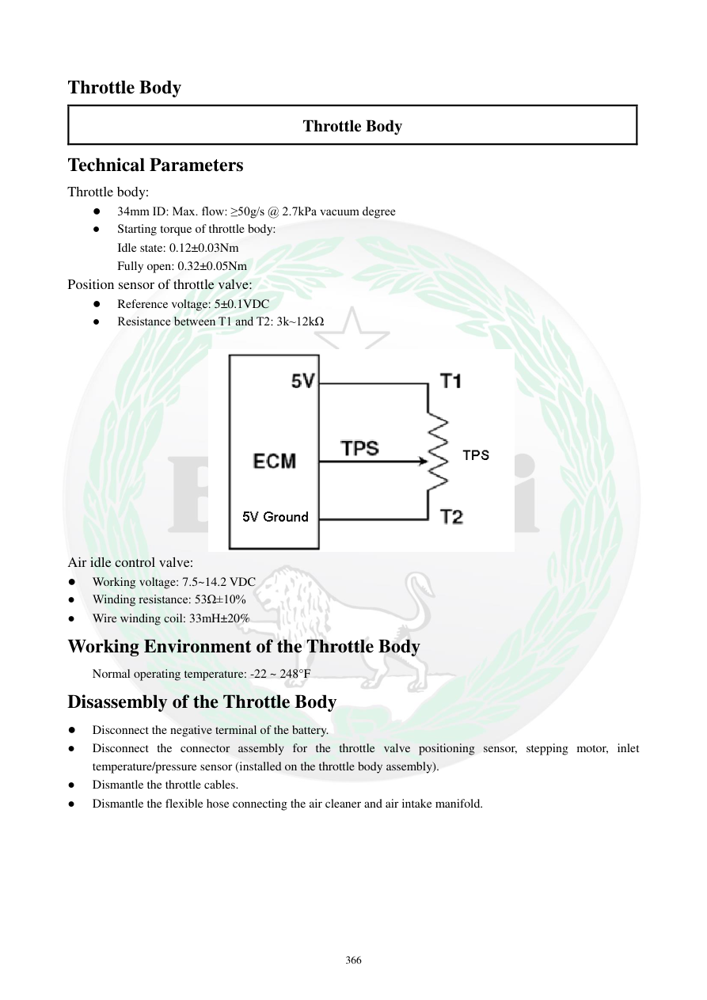

# Manual page 367

> Source: [page-0367.md](../source/page-0367.md)

## Page image / diagram

- [page-0367-img-01.png](../images/embedded/page-0367-img-01.png)

## Extracted text

# Source page 367

 
366 
Throttle Body 
Throttle Body 
Technical Parameters 
Throttle body: 
● 
34mm ID: Max. flow: ≥50g/s @ 2.7kPa vacuum degree   
● 
Starting torque of throttle body: 
Idle state: 0.12±0.03Nm   
Fully open: 0.32±0.05Nm 
Position sensor of throttle valve: 
● 
Reference voltage: 5±0.1VDC 
● 
Resistance between T1 and T2: 3k~12kΩ  
 
 
Air idle control valve: 
● 
Working voltage: 7.5~14.2 VDC  
● 
Winding resistance: 53Ω±10% 
● 
Wire winding coil: 33mH±20%   
Working Environment of the Throttle Body 
 
Normal operating temperature: -22 ~ 248°F  
Disassembly of the Throttle Body 
● 
Disconnect the negative terminal of the battery. 
● 
Disconnect the connector assembly for the throttle valve positioning sensor, stepping motor, inlet 
temperature/pressure sensor (installed on the throttle body assembly).   
● 
Dismantle the throttle cables. 
● 
Dismantle the flexible hose connecting the air cleaner and air intake manifold.

## Persian notes

### مشخصات فنی و شروع بازکردن Throttle Body
**مشخصات:**
- قطر داخلی دریچه: **34 mm**
- حداکثر دبی: **≥50 g/s در خلأ 2.7 kPa**
- گشتاور شروع حرکت دریچه در حالت دور آرام: **0.12±0.03 N·m**
- گشتاور در حالت کاملاً باز: **0.32±0.05 N·m**
- ولتاژ مرجع سنسور موقعیت: **5±0.1 VDC**
- مقاومت بین T1 و T2: **3 تا 12 kΩ**
- ولتاژ کاری شیر کنترل هوای دور آرام: **7.5 تا 14.2 VDC**
- مقاومت سیم‌پیچ: **53Ω±10٪**
- اندوکتانس سیم‌پیچ: **33 mH±20٪**
- دمای کاری عادی: **22- تا 248°F**، حدود **30- تا 120°C**.

**بازکردن:**
1. قطب منفی باتری را جدا کنید.
2. سوکت سنسور موقعیت دریچه، استپر موتور و سنسور دما/فشار ورودی را جدا کنید.
3. سیم‌های گاز را باز کنید.
4. شلنگ رابط Air Cleaner و Intake Manifold را جدا کنید.
- مقادیر مقاومت و ولتاژ برای تست با مولتی‌متر کاربرد دارند؛ قبل از تعویض قطعه باید سیم‌کشی و تغذیه نیز بررسی شود.
