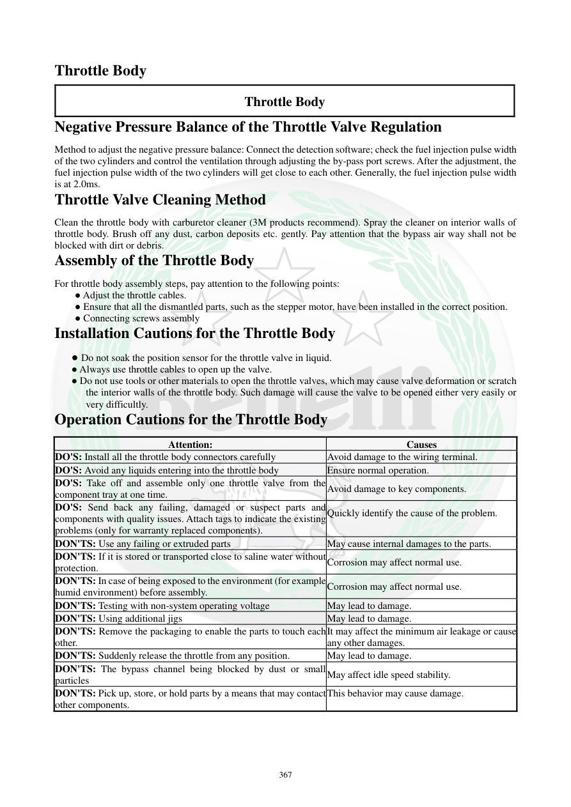

# Manual page 368

> Source: [page-0368.md](../source/page-0368.md)

## Page image / diagram

## Extracted text

# Source page 368

 
367 
Throttle Body 
Throttle Body 
Negative Pressure Balance of the Throttle Valve Regulation 
Method to adjust the negative pressure balance: Connect the detection software; check the fuel injection pulse width 
of the two cylinders and control the ventilation through adjusting the by-pass port screws. After the adjustment, the 
fuel injection pulse width of the two cylinders will get close to each other. Generally, the fuel injection pulse width 
is at 2.0ms.      
Throttle Valve Cleaning Method 
Clean the throttle body with carburetor cleaner (3M products recommend). Spray the cleaner on interior walls of 
throttle body. Brush off any dust, carbon deposits etc. gently. Pay attention that the bypass air way shall not be 
blocked with dirt or debris.  
Assembly of the Throttle Body 
For throttle body assembly steps, pay attention to the following points: 
● Adjust the throttle cables. 
● Ensure that all the dismantled parts, such as the stepper motor, have been installed in the correct position.  
● Connecting screws assembly 
Installation Cautions for the Throttle Body 
● Do not soak the position sensor for the throttle valve in liquid.  
● Always use throttle cables to open up the valve.  
● Do not use tools or other materials to open the throttle valves, which may cause valve deformation or scratch 
the interior walls of the throttle body. Such damage will cause the valve to be opened either very easily or 
very difficultly.  
Operation Cautions for the Throttle Body 
Attention: 
Causes 
DO'S: Install all the throttle body connectors carefully  
Avoid damage to the wiring terminal. 
DO'S: Avoid any liquids entering into the throttle body  
Ensure normal operation. 
DO'S: Take off and assemble only one throttle valve from the 
component tray at one time. 
Avoid damage to key components. 
DO'S: Send back any failing, damaged or suspect parts and 
components with quality issues. Attach tags to indicate the existing 
problems (only for warranty replaced components).  
Quickly identify the cause of the problem. 
 
DON'TS: Use any failing or extruded parts 
May cause internal damages to the parts. 
DON'TS: If it is stored or transported close to saline water without 
protection. 
Corrosion may affect normal use. 
DON'TS: In case of being exposed to the environment (for example 
humid environment) before assembly. 
Corrosion may affect normal use. 
DON'TS: Testing with non-system operating voltage  
May lead to damage. 
DON'TS: Using additional jigs 
May lead to damage. 
DON'TS: Remove the packaging to enable the parts to touch each 
other.  
It may affect the minimum air leakage or cause 
any other damages.  
DON'TS: Suddenly release the throttle from any position.  
May lead to damage. 
DON'TS: The bypass channel being blocked by dust or small 
particles  
May affect idle speed stability. 
DON'TS: Pick up, store, or hold parts by a means that may contact 
other components.  
This behavior may cause damage.

## Persian notes

<!-- Persian translation/explanation will be added here. -->
