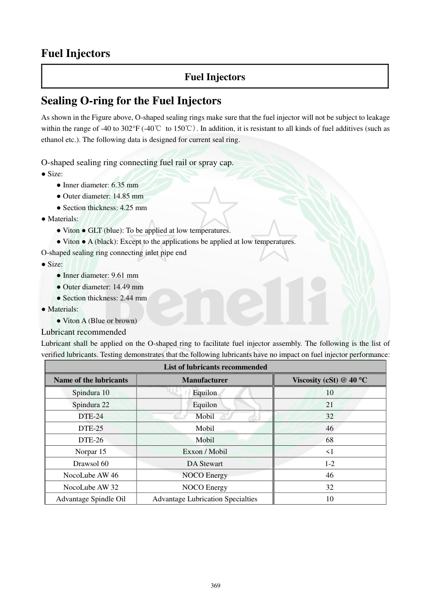

# Manual page 370

> Source: [page-0370.md](../source/page-0370.md)

## Page image / diagram

## Extracted text

# Source page 370

 
369 
Fuel Injectors 
Fuel Injectors 
Sealing O-ring for the Fuel Injectors 
As shown in the Figure above, O-shaped sealing rings make sure that the fuel injector will not be subject to leakage 
within the range of -40 to 302°F (-40℃ to 150℃). In addition, it is resistant to all kinds of fuel additives (such as 
ethanol etc.). The following data is designed for current seal ring.  
 
O-shaped sealing ring connecting fuel rail or spray cap.  
● Size: 
● Inner diameter: 6.35 mm 
● Outer diameter: 14.85 mm 
● Section thickness: 4.25 mm 
● Materials: 
● Viton ● GLT (blue): To be applied at low temperatures.  
● Viton ● A (black): Except to the applications be applied at low temperatures.  
O-shaped sealing ring connecting inlet pipe end 
● Size: 
● Inner diameter: 9.61 mm 
● Outer diameter: 14.49 mm 
● Section thickness: 2.44 mm 
● Materials: 
● Viton A (Blue or brown) 
Lubricant recommended 
Lubricant shall be applied on the O-shaped ring to facilitate fuel injector assembly. The following is the list of 
verified lubricants. Testing demonstrates that the following lubricants have no impact on fuel injector performance:  
List of lubricants recommended 
Name of the lubricants 
Manufacturer 
Viscosity (cSt) @ 40 °C 
Spindura 10 
Equilon 
10 
Spindura 22 
Equilon 
21 
DTE-24 
Mobil 
32 
DTE-25 
Mobil 
46 
DTE-26 
Mobil 
68 
Norpar 15 
Exxon / Mobil 
<1 
Drawsol 60 
DA Stewart 
1-2 
NocoLube AW 46 
NOCO Energy 
46 
NocoLube AW 32 
NOCO Energy 
32 
Advantage Spindle Oil 
Advantage Lubrication Specialties 
10

## Persian notes

### O-ring انژکتور
**O-ring سمت Fuel Rail / کلاهک تزریق:**
- قطر داخلی: **6.35 mm**
- قطر خارجی: **14.85 mm**
- ضخامت مقطع: **4.25 mm**
- جنس‌های ذکرشده: Viton GLT آبی برای دمای پایین و Viton A مشکی برای سایر کاربردها.

**O-ring سمت ورودی موتور:**
- قطر داخلی: **9.61 mm**
- قطر خارجی: **14.49 mm**
- ضخامت مقطع: **2.44 mm**
- جنس: Viton A، آبی یا قهوه‌ای.

- هنگام نصب برای جلوگیری از آسیب O-ring از مقدار کمی روان‌کننده مناسب استفاده شود.
- دفترچه چند روغن تأییدشده را فهرست کرده است؛ برای جایگزین‌کردن روان‌کننده بدون تطبیق مشخصات، حدس نزنید.
