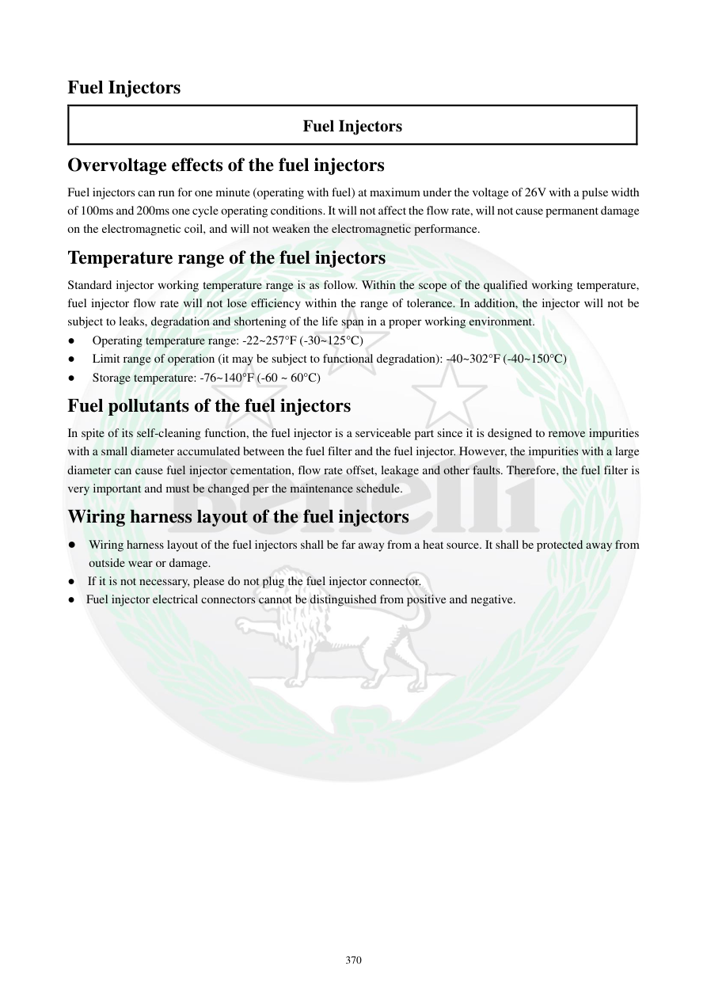

# Manual page 371

> Source: [page-0371.md](../source/page-0371.md)

## Page image / diagram

## Extracted text

# Source page 371

 
370 
Fuel Injectors 
Fuel Injectors 
Overvoltage effects of the fuel injectors 
Fuel injectors can run for one minute (operating with fuel) at maximum under the voltage of 26V with a pulse width 
of 100ms and 200ms one cycle operating conditions. It will not affect the flow rate, will not cause permanent damage 
on the electromagnetic coil, and will not weaken the electromagnetic performance.  
Temperature range of the fuel injectors 
Standard injector working temperature range is as follow. Within the scope of the qualified working temperature, 
fuel injector flow rate will not lose efficiency within the range of tolerance. In addition, the injector will not be 
subject to leaks, degradation and shortening of the life span in a proper working environment.  
● 
Operating temperature range: -22~257°F (-30~125°C)  
● 
Limit range of operation (it may be subject to functional degradation): -40~302°F (-40~150°C)  
● 
Storage temperature: -76~140°F (-60 ~ 60°C) 
Fuel pollutants of the fuel injectors 
In spite of its self-cleaning function, the fuel injector is a serviceable part since it is designed to remove impurities 
with a small diameter accumulated between the fuel filter and the fuel injector. However, the impurities with a large 
diameter can cause fuel injector cementation, flow rate offset, leakage and other faults. Therefore, the fuel filter is 
very important and must be changed per the maintenance schedule.  
Wiring harness layout of the fuel injectors 
● Wiring harness layout of the fuel injectors shall be far away from a heat source. It shall be protected away from 
outside wear or damage.  
●  If it is not necessary, please do not plug the fuel injector connector.  
● Fuel injector electrical connectors cannot be distinguished from positive and negative.

## Persian notes

### شرایط کاری انژکتور و آلودگی سوخت
- طبق تست ذکرشده، انژکتور می‌تواند در شرایط مشخص تا **26 V** و به مدت حداکثر یک دقیقه کار کند بدون اینکه دبی آن تحت شرایط آزمون تغییر کند؛ این موضوع به معنی مجاز بودن استفاده عادی با 26 ولت نیست.
- محدوده دمای کاری استاندارد: **30- تا 125°C**.
- محدوده حدی: **40- تا 150°C** که ممکن است افت عملکرد ایجاد شود.
- دمای نگهداری طبق متن: **60- تا 60°C**.
- آلودگی‌های بزرگ می‌توانند باعث گیرکردن سوزن، تغییر دبی و نشتی شوند.
- فیلتر سوخت اهمیت زیادی دارد و باید طبق برنامه سرویس تعویض شود.
- دسته‌سیم انژکتور باید از منابع حرارتی و سایش دور باشد.
- کانکتورهای انژکتور از نظر مثبت و منفی قابل تشخیص نیستند، بنابراین طبق متن اتصال آنها قطب‌بندی مثبت/منفی مشخصی ندارد.
