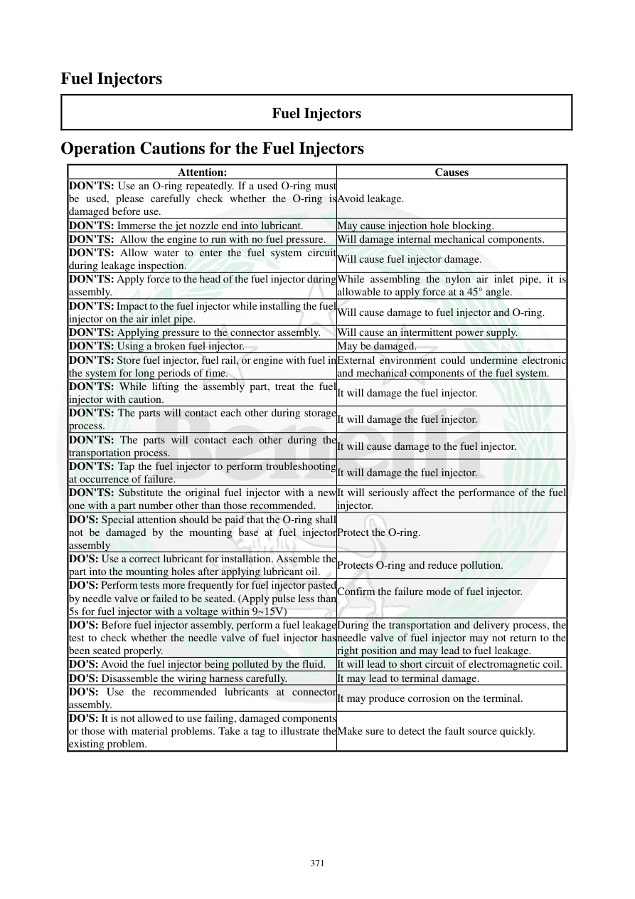

# Manual page 372

> Source: [page-0372.md](../source/page-0372.md)

## Page image / diagram

## Extracted text

# Source page 372

 
371 
Fuel Injectors 
Fuel Injectors 
Operation Cautions for the Fuel Injectors 
Attention: 
Causes 
DON'TS: Use an O-ring repeatedly. If a used O-ring must
be used, please carefully check whether the O-ring is
damaged before use. 
Avoid leakage. 
DON'TS: Immerse the jet nozzle end into lubricant. 
May cause injection hole blocking. 
DON'TS: Allow the engine to run with no fuel pressure. Will damage internal mechanical components. 
DON'TS: Allow water to enter the fuel system circuit
during leakage inspection.  
Will cause fuel injector damage. 
DON'TS: Apply force to the head of the fuel injector during
assembly.  
While assembling the nylon air inlet pipe, it is 
allowable to apply force at a 45° angle.  
DON'TS: Impact to the fuel injector while installing the fuel
injector on the air inlet pipe.  
Will cause damage to fuel injector and O-ring.   
DON'TS: Applying pressure to the connector assembly.  Will cause an intermittent power supply. 
DON'TS: Using a broken fuel injector. 
May be damaged. 
DON'TS: Store fuel injector, fuel rail, or engine with fuel in
the system for long periods of time.   
External environment could undermine electronic 
and mechanical components of the fuel system.  
DON'TS: While lifting the assembly part, treat the fuel
injector with caution.  
It will damage the fuel injector. 
DON'TS: The parts will contact each other during storage
process.  
It will damage the fuel injector.  
DON'TS: The parts will contact each other during the
transportation process. 
It will cause damage to the fuel injector. 
DON'TS: Tap the fuel injector to perform troubleshooting
at occurrence of failure. 
It will damage the fuel injector. 
DON'TS: Substitute the original fuel injector with a new
one with a part number other than those recommended. 
It will seriously affect the performance of the fuel 
injector. 
DO'S: Special attention should be paid that the O-ring shall
not be damaged by the mounting base at fuel injector
assembly 
Protect the O-ring. 
DO'S: Use a correct lubricant for installation. Assemble the
part into the mounting holes after applying lubricant oil.  Protects O-ring and reduce pollution. 
DO'S: Perform tests more frequently for fuel injector pasted
by needle valve or failed to be seated. (Apply pulse less than
5s for fuel injector with a voltage within 9~15V)  
Confirm the failure mode of fuel injector.  
DO'S: Before fuel injector assembly, perform a fuel leakage
test to check whether the needle valve of fuel injector has
been seated properly.  
During the transportation and delivery process, the 
needle valve of fuel injector may not return to the 
right position and may lead to fuel leakage.  
DO'S: Avoid the fuel injector being polluted by the fluid.  It will lead to short circuit of electromagnetic coil. 
DO'S: Disassemble the wiring harness carefully.  
It may lead to terminal damage.  
DO'S: Use the recommended lubricants at connector
assembly.  
It may produce corrosion on the terminal.  
DO'S: It is not allowed to use failing, damaged components
or those with material problems. Take a tag to illustrate the
existing problem.  
Make sure to detect the fault source quickly.

## Persian notes

### نکات مهم هنگام کار با انژکتور
- O-ring کارکرده را دوباره استفاده نکنید؛ اگر ناچار به استفاده مجدد شدید، کوچک‌ترین آسیب را بررسی کنید، چون می‌تواند باعث نشتی شود.
- سر نازل انژکتور را داخل روغن/روان‌کننده فرو نبرید؛ سوراخ‌های پاشش ممکن است مسدود شوند.
- موتور را بدون فشار سوخت روشن نکنید.
- هنگام نصب به سر انژکتور ضربه نزنید و به کانکتور فشار وارد نکنید.
- انژکتور، Fuel Rail و موتور را برای مدت طولانی با سوخت داخل سیستم انبار نکنید.
- برای عیب‌یابی به انژکتور ضربه نزنید.
- انژکتور جایگزین باید همان Part Number توصیه‌شده را داشته باشد.
- O-ring هنگام ورود به محل نصب نباید بریده یا له شود و روان‌کننده مناسب باید استفاده شود.
- قبل از نصب، تست نشتی و نشستن صحیح سوزن انجام شود.
- در تست عملکردی ذکرشده برای انژکتور مشکوک، پالس کمتر از **5 ثانیه** با ولتاژ **9 تا 15 V** توصیه شده است.
