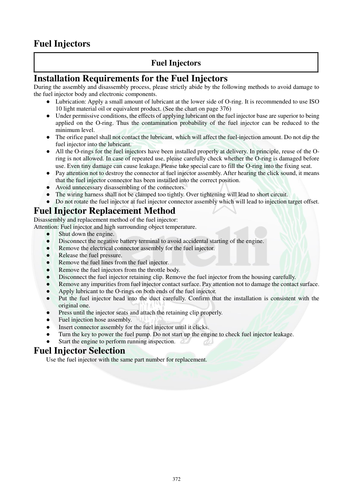

# Manual page 373

> Source: [page-0373.md](../source/page-0373.md)

## Page image / diagram

## Extracted text

# Source page 373

 
372 
Fuel Injectors 
Fuel Injectors 
Installation Requirements for the Fuel Injectors 
During the assembly and disassembly process, please strictly abide by the following methods to avoid damage to 
the fuel injector body and electronic components.   
● Lubrication: Apply a small amount of lubricant at the lower side of O-ring. It is recommended to use ISO 
10 light material oil or equivalent product. (See the chart on page 376) 
● Under permissive conditions, the effects of applying lubricant on the fuel injector base are superior to being 
applied on the O-ring. Thus the contamination probability of the fuel injector can be reduced to the 
minimum level.  
● The orifice panel shall not contact the lubricant, which will affect the fuel-injection amount. Do not dip the 
fuel injector into the lubricant.  
● All the O-rings for the fuel injectors have been installed properly at delivery. In principle, reuse of the O-
ring is not allowed. In case of repeated use, please carefully check whether the O-ring is damaged before 
use. Even tiny damage can cause leakage. Please take special care to fill the O-ring into the fixing seat.  
● Pay attention not to destroy the connector at fuel injector assembly. After hearing the click sound, it means 
that the fuel injector connector has been installed into the correct position.  
● Avoid unnecessary disassembling of the connectors. 
● The wiring harness shall not be clamped too tightly. Over tightening will lead to short circuit.  
● Do not rotate the fuel injector at fuel injector connector assembly which will lead to injection target offset.  
Fuel Injector Replacement Method 
Disassembly and replacement method of the fuel injector: 
Attention: Fuel injector and high surrounding object temperature.  
●  Shut down the engine. 
● 
Disconnect the negative battery terminal to avoid accidental starting of the engine.  
● 
Remove the electrical connector assembly for the fuel injector.  
● 
Release the fuel pressure.  
● 
Remove the fuel lines from the fuel injector.  
● 
Remove the fuel injectors from the throttle body.  
●  Disconnect the fuel injector retaining clip. Remove the fuel injector from the housing carefully.  
●  Remove any impurities from fuel injector contact surface. Pay attention not to damage the contact surface.  
● 
Apply lubricant to the O-rings on both ends of the fuel injector.  
● 
Put the fuel injector head into the duct carefully. Confirm that the installation is consistent with the   
original one.  
● 
Press until the injector seats and attach the retaining clip properly.  
● 
Fuel injection hose assembly. 
● 
Insert connector assembly for the fuel injector until it clicks.  
● 
Turn the key to power the fuel pump. Do not start up the engine to check fuel injector leakage.  
● 
Start the engine to perform running inspection.  
Fuel Injector Selection 
Use the fuel injector with the same part number for replacement.

## Persian notes

<!-- Persian translation/explanation will be added here. -->
