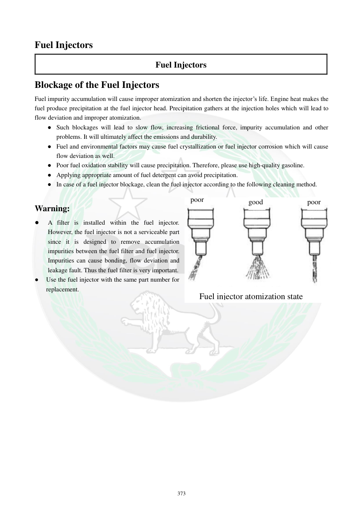

# Manual page 374

> Source: [page-0374.md](../source/page-0374.md)

## Page image / diagram

- [page-0374-img-01.jpeg](../images/embedded/page-0374-img-01.jpeg)

## Extracted text

# Source page 374

 
373 
Fuel Injectors 
Fuel Injectors 
Blockage of the Fuel Injectors 
Fuel impurity accumulation will cause improper atomization and shorten the injector’s life. Engine heat makes the 
fuel produce precipitation at the fuel injector head. Precipitation gathers at the injection holes which will lead to 
flow deviation and improper atomization.   
● Such blockages will lead to slow flow, increasing frictional force, impurity accumulation and other 
problems. It will ultimately affect the emissions and durability.  
● Fuel and environmental factors may cause fuel crystallization or fuel injector corrosion which will cause 
flow deviation as well.  
● Poor fuel oxidation stability will cause precipitation. Therefore, please use high-quality gasoline.  
● Applying appropriate amount of fuel detergent can avoid precipitation.  
● In case of a fuel injector blockage, clean the fuel injector according to the following cleaning method.  
 
Warning: 
● 
A filter is installed within the fuel injector. 
However, the fuel injector is not a serviceable part 
since it is designed to remove accumulation 
impurities between the fuel filter and fuel injector. 
Impurities can cause bonding, flow deviation and 
leakage fault. Thus the fuel filter is very important.  
● 
Use the fuel injector with the same part number for 
replacement.  
 
 
 
 
 
poor 
poor 
good 
Fuel injector atomization state

## Persian notes

### گرفتگی و الگوی پاشش انژکتور
- تجمع ناخالصی باعث بدشدن اتمیزه‌شدن سوخت و کاهش عمر انژکتور می‌شود.
- حرارت موتور می‌تواند باعث ایجاد رسوب در نوک انژکتور و گرفتگی سوراخ‌های پاشش شود.
- نتیجه می‌تواند کاهش دبی، تغییر الگوی پاشش، نشتی و اثر منفی بر آلایندگی و دوام موتور باشد.
- سوخت و شرایط محیطی نیز می‌توانند باعث کریستالی‌شدن یا خوردگی انژکتور شوند.
- پایداری اکسیداسیونی پایین سوخت می‌تواند رسوب ایجاد کند؛ دفترچه استفاده از بنزین باکیفیت را توصیه می‌کند.
- در صورت گرفتگی، انژکتور طبق روش تمیزکاری تعیین‌شده در ادامه دفترچه سرویس شود.
- وجود فیلتر داخل انژکتور به معنی قابل‌تعمیر بودن خود انژکتور نیست؛ فیلتر اصلی سوخت نقش مهمی در جلوگیری از ورود آلودگی دارد.
- انژکتور تعویضی باید همان Part Number مشخص‌شده را داشته باشد.
- تصویر پایین صفحه برای تشخیص **الگوی پاشش خوب و بد** مرجع است.
