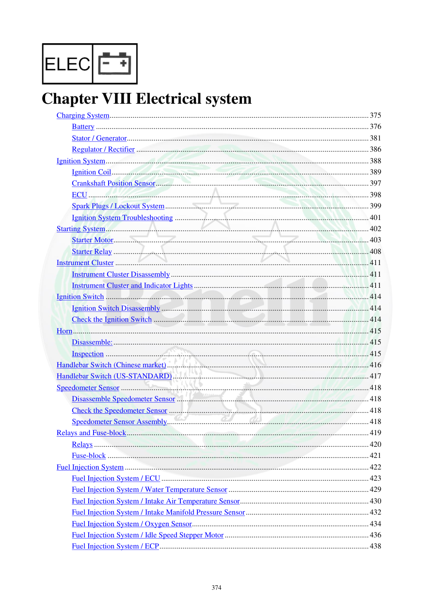

# Manual page 375

> Source: [page-0375.md](../source/page-0375.md)

## Page image / diagram

## Extracted text

# Source page 375

 
374 
 
Chapter VIII Electrical system 
Charging System ....................................................................................................................................... 375 
Battery .............................................................................................................................................. 376 
Stator / Generator .............................................................................................................................. 381 
Regulator / Rectifier ......................................................................................................................... 386 
Ignition System ......................................................................................................................................... 388 
Ignition Coil ...................................................................................................................................... 389 
Crankshaft Position Sensor ............................................................................................................... 397 
ECU .................................................................................................................................................. 398 
Spark Plugs / Lockout System .......................................................................................................... 399 
Ignition System Troubleshooting ..................................................................................................... 401 
Starting System ......................................................................................................................................... 402 
Starter Motor..................................................................................................................................... 403 
Starter Relay ..................................................................................................................................... 408 
Instrument Cluster .................................................................................................................................... 411 
Instrument Cluster Disassembly ....................................................................................................... 411 
Instrument Cluster and Indicator Lights ........................................................................................... 411 
Ignition Switch ......................................................................................................................................... 414 
Ignition Switch Disassembly ............................................................................................................ 414 
Check the Ignition Switch ................................................................................................................ 414 
Horn .......................................................................................................................................................... 415 
Disassemble: ..................................................................................................................................... 415 
Inspection ......................................................................................................................................... 415 
Handlebar Switch (Chinese market) ......................................................................................................... 416 
Handlebar Switch (US-STANDARD) ...................................................................................................... 417 
Speedometer Sensor ................................................................................................................................. 418 
Disassemble Speedometer Sensor .................................................................................................... 418 
Check the Speedometer Sensor ........................................................................................................ 418 
Speedometer Sensor Assembly ......................................................................................................... 418 
Relays and Fuse-block .............................................................................................................................. 419 
Relays ............................................................................................................................................... 420 
Fuse-block ........................................................................................................................................ 421 
Fuel Injection System ............................................................................................................................... 422 
Fuel Injection System / ECU ............................................................................................................ 423 
Fuel Injection System / Water Temperature Sensor ......................................................................... 429 
Fuel Injection System / Intake Air Temperature Sensor ................................................................... 430 
Fuel Injection System / Intake Manifold Pressure Sensor ................................................................ 432 
Fuel Injection System / Oxygen Sensor ............................................................................................ 434 
Fuel Injection System / Idle Speed Stepper Motor ........................................................................... 436 
Fuel Injection System / ECP ............................................................................................................. 438

## Persian notes

### فصل VIII: سیستم برق
فصل هشتم از صفحه 375 آغاز می‌شود و این بخش‌ها را پوشش می‌دهد:
- سیستم شارژ
- باتری
- استاتور/ژنراتور
- رگولاتور/رکتیفایر
- سیستم جرقه‌زنی و کوئل
- سنسور موقعیت میل‌لنگ
- ECU
- شمع و سیستم Lockout
- عیب‌یابی سیستم جرقه
- سیستم استارت، موتور استارت و رله استارت
- صفحه کیلومتر و چراغ‌های نشانگر
- سوئیچ اصلی و بوق
- کلیدهای روی فرمان
- سنسور سرعت
- رله‌ها و جعبه فیوز
- سیستم انژکتوری و سنسورهای دما، هوای ورودی، فشار منیفولد، اکسیژن، استپر دور آرام و ECP.
- بازه کلی این فصل: **صفحات 375 تا 439**.
