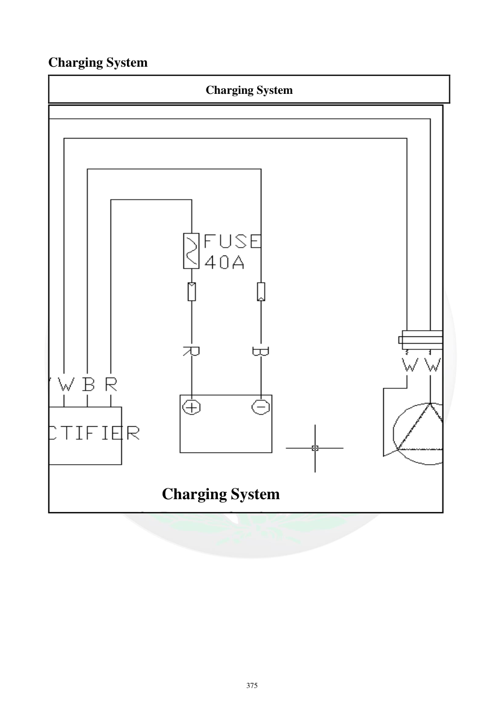

# Manual page 376

> Source: [page-0376.md](../source/page-0376.md)

## Page image / diagram

- [page-0376-img-01.png](../images/embedded/page-0376-img-01.png)

## Extracted text

# Source page 376

 
375 
Charging System 
Charging System 
 
  
 
 
Charging System

## Persian notes

### سیستم شارژ
- این صفحه عمدتاً **نقشه/دیاگرام سیستم شارژ** را ارائه می‌کند و متن استخراج‌شده اطلاعات عددی قابل اتکایی ندارد.
- برای فهم مسیر تولید و تنظیم برق، تصویر صفحه مرجع اصلی است.
- در استفاده از این صفحه برای عیب‌یابی، اجزای نشان‌داده‌شده در دیاگرام را با صفحات بعدی فصل برق تطبیق دهید؛ صفحات بعدی مشخصات و روش تست باتری، استاتور و رگولاتور را ارائه می‌کنند.
