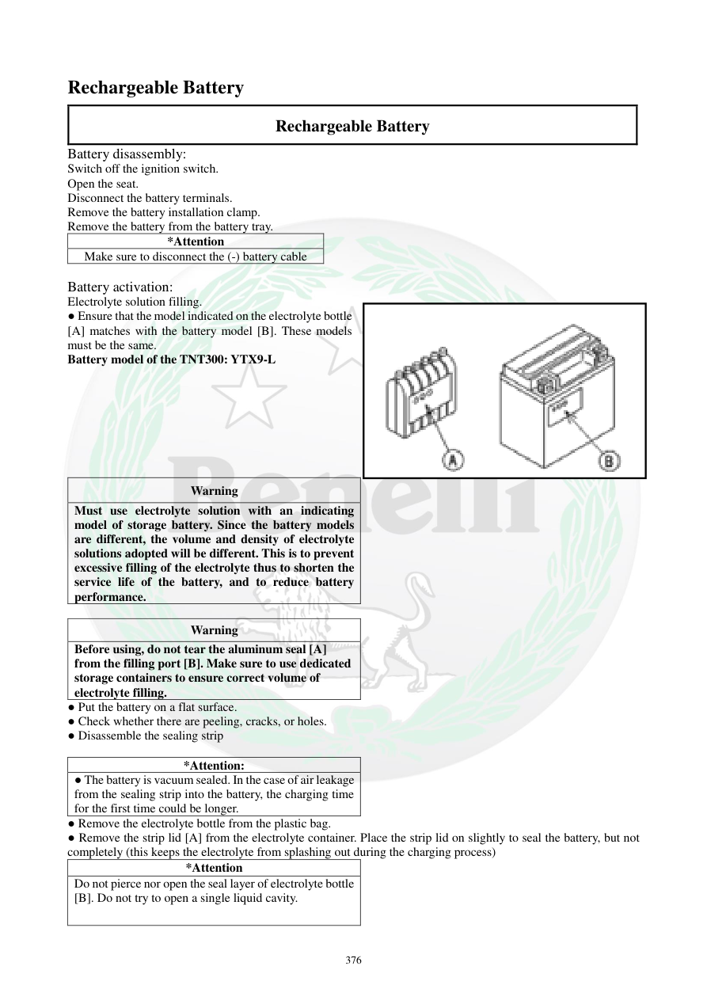

# Manual page 377

> Source: [page-0377.md](../source/page-0377.md)

## Page image / diagram

- [page-0377-img-01.png](../images/embedded/page-0377-img-01.png)

## Extracted text

# Source page 377

 
376 
Rechargeable Battery 
Rechargeable Battery 
Battery disassembly: 
Switch off the ignition switch. 
Open the seat. 
Disconnect the battery terminals. 
Remove the battery installation clamp.  
Remove the battery from the battery tray. 
*Attention 
Make sure to disconnect the (-) battery cable 
 
Battery activation: 
Electrolyte solution filling. 
● Ensure that the model indicated on the electrolyte bottle 
[A] matches with the battery model [B]. These models 
must be the same.  
Battery model of the TNT300: YTX9-L  
 
Warning 
Must use electrolyte solution with an indicating 
model of storage battery. Since the battery models 
are different, the volume and density of electrolyte 
solutions adopted will be different. This is to prevent 
excessive filling of the electrolyte thus to shorten the 
service life of the battery, and to reduce battery 
performance.  
 
Warning 
Before using, do not tear the aluminum seal [A] 
from the filling port [B]. Make sure to use dedicated 
storage containers to ensure correct volume of 
electrolyte filling. 
● Put the battery on a flat surface.  
● Check whether there are peeling, cracks, or holes.  
● Disassemble the sealing strip  
 
*Attention: 
● The battery is vacuum sealed. In the case of air leakage 
from the sealing strip into the battery, the charging time 
for the first time could be longer.  
● Remove the electrolyte bottle from the plastic bag.  
● Remove the strip lid [A] from the electrolyte container. Place the strip lid on slightly to seal the battery, but not   
completely (this keeps the electrolyte from splashing out during the charging process)  
*Attention 
Do not pierce nor open the seal layer of electrolyte bottle 
[B]. Do not try to open a single liquid cavity.

## Persian notes

### باز کردن و فعال‌سازی باتری
**باز کردن باتری:**
1. سوئیچ را خاموش کنید.
2. صندلی را باز کنید.
3. ترمینال‌های باتری را جدا کنید.
4. بست نگهدارنده باتری را باز کنید.
5. باتری را از سینی خارج کنید.
- نکته مهم: طبق دفترچه ابتدا **کابل منفی (-)** باتری جدا شود.

**فعال‌سازی باتری اسیدی/الکترولیتی:**
- مدل درج‌شده روی بطری الکترولیت باید دقیقاً با مدل باتری مطابقت داشته باشد.
- مدل باتری ذکرشده برای **TNT300: YTX9-L** است.
- حجم و چگالی الکترولیت باید متناسب با مدل باتری باشد؛ استفاده از الکترولیت نامناسب می‌تواند عمر و عملکرد باتری را کاهش دهد.
- قبل از استفاده، لایه آلومینیومی دهانه بطری/محفظه را طبق دستورالعمل جدا نکنید و از ظرف/بسته مخصوص خود باتری استفاده کنید.
- باتری را روی سطح صاف قرار دهید و از نظر ترک، جداشدگی یا سوراخ بررسی کنید.
- نوار آب‌بندی باتری را طبق دستورالعمل جدا کنید.
- باتری و الکترولیت در این مرحله باید طبق دستورالعمل سازنده و در محیط دارای تهویه مناسب کار شوند.
- چون باتری و مشخصات آن در متن به‌طور مشخص **TNT300** ذکر شده، این مقدار را بدون تطبیق با باتری واقعی TNT249 به آن تعمیم ندهید.
