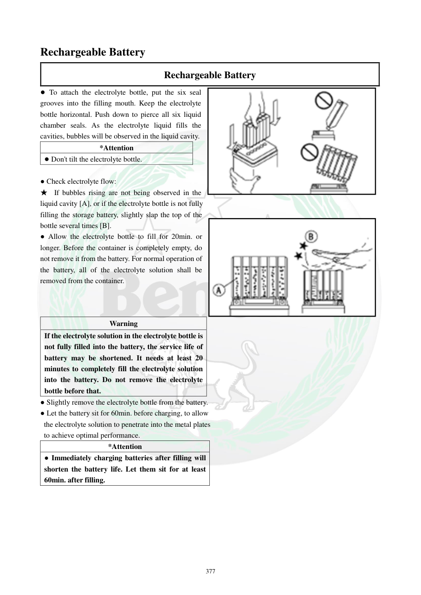

# Manual page 378

> Source: [page-0378.md](../source/page-0378.md)

## Page image / diagram

- [page-0378-img-01.png](../images/embedded/page-0378-img-01.png)

- [page-0378-img-02.png](../images/embedded/page-0378-img-02.png)

## Extracted text

# Source page 378

 
377 
Rechargeable Battery 
Rechargeable Battery 
● To attach the electrolyte bottle, put the six seal 
grooves into the filling mouth. Keep the electrolyte 
bottle horizontal. Push down to pierce all six liquid 
chamber seals. As the electrolyte liquid fills the 
cavities, bubbles will be observed in the liquid cavity.  
*Attention 
● Don't tilt the electrolyte bottle.  
 
● Check electrolyte flow: 
★ If bubbles rising are not being observed in the 
liquid cavity [A], or if the electrolyte bottle is not fully  
filling the storage battery, slightly slap the top of the 
bottle several times [B].  
● Allow the electrolyte bottle to fill for 20min. or 
longer. Before the container is completely empty, do 
not remove it from the battery. For normal operation of 
the battery, all of the electrolyte solution shall be 
removed from the container.  
 
Warning 
If the electrolyte solution in the electrolyte bottle is 
not fully filled into the battery, the service life of 
battery may be shortened. It needs at least 20 
minutes to completely fill the electrolyte solution 
into the battery. Do not remove the electrolyte 
bottle before that.  
● Slightly remove the electrolyte bottle from the battery.  
● Let the battery sit for 60min. before charging, to allow  
the electrolyte solution to penetrate into the metal plates 
 to achieve optimal performance.  
*Attention 
● Immediately charging batteries after filling will 
shorten the battery life. Let them sit for at least 
60min. after filling.

## Persian notes

### فعال‌سازی باتری: افزودن الکترولیت
- بطری الکترولیت را افقی نگه دارید و هر **۶ زبانه آب‌بندی** را هم‌زمان روی دهانه باتری قرار دهید.
- بطری را عمودی نکنید و آن را کج نکنید؛ پس از سوراخ‌شدن محفظه‌ها باید حباب‌های عبوری دیده شوند.
- اگر حبابی دیده نمی‌شود یا جریان الکترولیت متوقف شد، بالای بطری را چند ضربه بسیار آرام بزنید.
- اجازه دهید تمام الکترولیت حداقل **۲۰ دقیقه** وارد باتری شود. بطری را قبل از تخلیه کامل جدا نکنید.
- پس از پایان، بطری را کمی از باتری جدا کنید و باتری را حداقل **۶۰ دقیقه** بدون شارژ رها کنید تا الکترولیت در صفحات نفوذ کند.
- شارژ فوری پس از افزودن الکترولیت می‌تواند عمر باتری را کاهش دهد.
