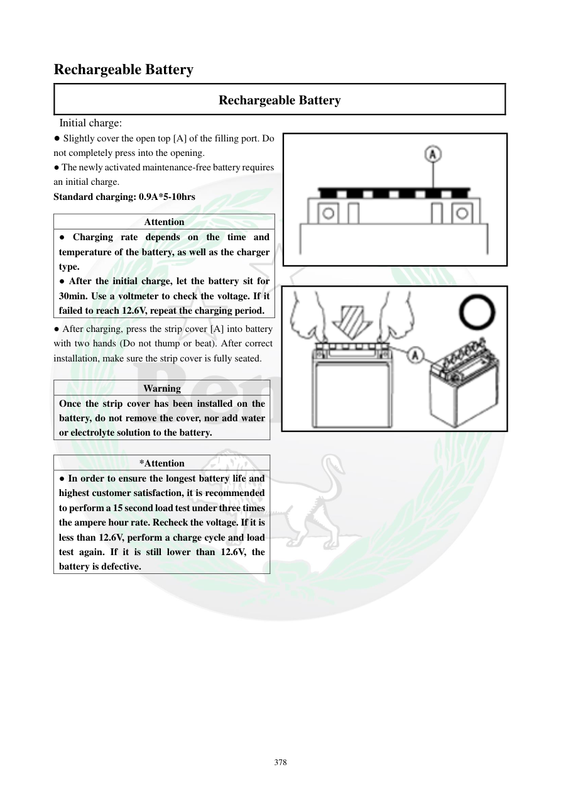

# Manual page 379

> Source: [page-0379.md](../source/page-0379.md)

## Page image / diagram

- [page-0379-img-01.png](../images/embedded/page-0379-img-01.png)

- [page-0379-img-02.png](../images/embedded/page-0379-img-02.png)

## Extracted text

# Source page 379

 
378 
Rechargeable Battery 
Rechargeable Battery 
 Initial charge: 
● Slightly cover the open top [A] of the filling port. Do 
not completely press into the opening.  
● The newly activated maintenance-free battery requires 
an initial charge.  
Standard charging: 0.9A*5-10hrs   
 
● After charging, press the strip cover [A] into battery 
with two hands (Do not thump or beat). After correct 
installation, make sure the strip cover is fully seated.  
 
Warning 
Once the strip cover has been installed on the 
battery, do not remove the cover, nor add water 
or electrolyte solution to the battery.  
 
*Attention 
● In order to ensure the longest battery life and 
highest customer satisfaction, it is recommended 
to perform a 15 second load test under three times 
the ampere hour rate. Recheck the voltage. If it is 
less than 12.6V, perform a charge cycle and load 
test again. If it is still lower than 12.6V, the 
battery is defective.  
 
Attention 
● Charging rate depends on the time and 
temperature of the battery, as well as the charger 
type.    
● After the initial charge, let the battery sit for 
30min. Use a voltmeter to check the voltage. If it 
failed to reach 12.6V, repeat the charging period.

## Persian notes

### شارژ اولیه باتری
- پس از فعال‌سازی، باتری نیاز به شارژ اولیه دارد.
- نرخ شارژ استاندارد: **0.9 A به مدت 5 تا 10 ساعت**.
- پس از شارژ، درپوش نوار آب‌بندی را با دو دست و بدون ضربه کاملاً جا بزنید.
- بعد از نصب نوار، آن را دوباره خارج نکنید و آب یا الکترولیت اضافه نکنید.
- تست بار پیشنهادی: **۱۵ ثانیه** با بار معادل سه برابر ظرفیت آمپرساعت، سپس ولتاژ بررسی شود.
- اگر ولتاژ کمتر از **12.6 V** بود، یک چرخه شارژ و تست بار دیگر انجام دهید؛ اگر باز هم زیر 12.6 V ماند، باتری معیوب تلقی می‌شود.
- پس از شارژ اولیه **۳۰ دقیقه** صبر کنید و ولتاژ را اندازه بگیرید؛ اگر به 12.6 V نرسیده بود، شارژ را تکرار کنید.
