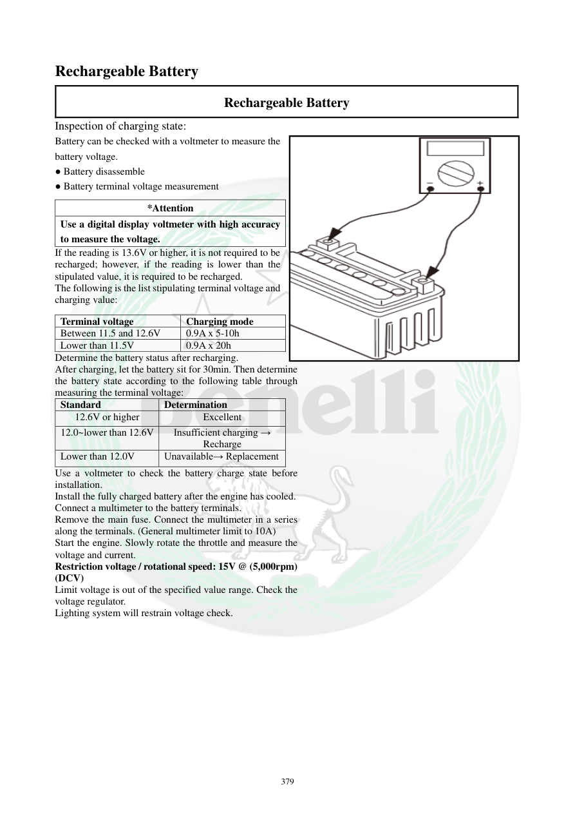

# Manual page 380

> Source: [page-0380.md](../source/page-0380.md)

## Page image / diagram

- [page-0380-img-01.png](../images/embedded/page-0380-img-01.png)

## Extracted text

# Source page 380

 
379 
Rechargeable Battery 
Rechargeable Battery 
Inspection of charging state: 
Battery can be checked with a voltmeter to measure the 
battery voltage.  
● Battery disassemble 
● Battery terminal voltage measurement 
If the reading is 13.6V or higher, it is not required to be 
recharged; however, if the reading is lower than the 
stipulated value, it is required to be recharged.  
The following is the list stipulating terminal voltage and 
charging value:   
Determine the battery status after recharging.   
After charging, let the battery sit for 30min. Then determine 
the battery state according to the following table through 
measuring the terminal voltage:  
Standard 
Determination 
12.6V or higher 
Excellent 
12.0~lower than 12.6V 
Insufficient charging → 
Recharge 
Lower than 12.0V 
Unavailable→ Replacement 
Use a voltmeter to check the battery charge state before 
installation.  
Install the fully charged battery after the engine has cooled.  
Connect a multimeter to the battery terminals.  
Remove the main fuse. Connect the multimeter in a series 
along the terminals. (General multimeter limit to 10A) 
Start the engine. Slowly rotate the throttle and measure the 
voltage and current.  
Restriction voltage / rotational speed: 15V @ (5,000rpm) 
(DCV)  
Limit voltage is out of the specified value range. Check the 
voltage regulator.  
Lighting system will restrain voltage check. 
 
 
*Attention 
Use a digital display voltmeter with high accuracy 
to measure the voltage.  
Terminal voltage 
Charging mode  
Between 11.5 and 12.6V 
0.9A x 5-10h 
Lower than 11.5V 
0.9A x 20h

## Persian notes

<!-- Persian translation/explanation will be added here. -->
