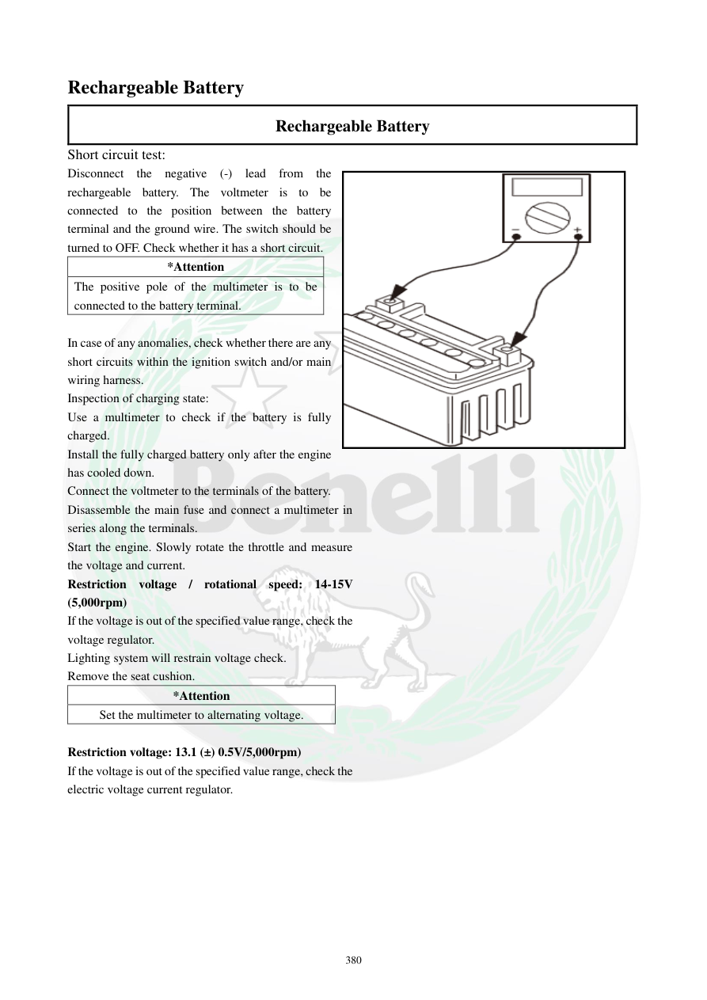

# Manual page 381

> Source: [page-0381.md](../source/page-0381.md)

## Page image / diagram

## Extracted text

# Source page 381

 
380 
Rechargeable Battery 
Rechargeable Battery 
Short circuit test: 
Disconnect the negative (-) lead from the 
rechargeable battery. The voltmeter is to be 
connected to the position between the battery 
terminal and the ground wire. The switch should be 
turned to OFF. Check whether it has a short circuit.  
*Attention 
The positive pole of the multimeter is to be 
connected to the battery terminal. 
 
In case of any anomalies, check whether there are any 
short circuits within the ignition switch and/or main 
wiring harness.   
Inspection of charging state: 
Use a multimeter to check if the battery is fully 
charged.  
Install the fully charged battery only after the engine 
has cooled down.  
Connect the voltmeter to the terminals of the battery. 
Disassemble the main fuse and connect a multimeter in 
series along the terminals.  
Start the engine. Slowly rotate the throttle and measure 
the voltage and current.  
Restriction voltage / rotational speed: 14-15V 
(5,000rpm) 
If the voltage is out of the specified value range, check the 
voltage regulator.  
Lighting system will restrain voltage check.  
Remove the seat cushion.  
*Attention 
Set the multimeter to alternating voltage. 
 
Restriction voltage: 13.1 (±) 0.5V/5,000rpm) 
If the voltage is out of the specified value range, check the 
electric voltage current regulator.

## Persian notes

### تست اتصال کوتاه و بررسی شارژ
**تست اتصال کوتاه:**
- قطب منفی باتری را جدا کنید.
- ولت‌متر بین ترمینال باتری و سیم اتصال بدنه قرار گیرد.
- سوئیچ باید روی OFF باشد.
- قطب مثبت مولتی‌متر به ترمینال باتری وصل شود.
- در صورت وجود مشکل، مسیر سوئیچ اصلی و دسته‌سیم اصلی از نظر اتصال کوتاه بررسی شود.

**کنترل سیستم شارژ:**
- باتری کاملاً شارژ باشد و پس از خنک‌شدن موتور نصب شود.
- در تست ولتاژ/جریان شارژ، دفترچه مقدار **14 تا 15 V در 5000 rpm** را ذکر می‌کند.
- اگر ولتاژ خارج از این محدوده باشد، رگولاتور/رکتیفایر بررسی شود.
- در تست استاتور، مولتی‌متر روی **AC Voltage** قرار می‌گیرد و مقدار ذکرشده در متن **13.1 ±0.5 V در 5000 rpm** است؛ چون این مقدار با روش تست استاتور در صفحه 385 تفاوت دارد، برای انتخاب روش دقیق، تصویر صفحه و مدار مربوطه مرجع نهایی است.
