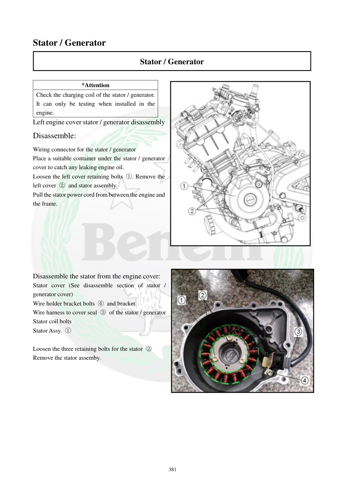

# Manual page 382

> Source: [page-0382.md](../source/page-0382.md)

## Page image / diagram

- [page-0382-img-01.jpeg](../images/embedded/page-0382-img-01.jpeg)

- [page-0382-img-02.jpeg](../images/embedded/page-0382-img-02.jpeg)

## Extracted text

# Source page 382

 
381 
Stator / Generator 
Stator / Generator 
 
*Attention 
Check the charging coil of the stator / generator. 
It can only be testing when installed in the 
engine.  
Left engine cover stator / generator disassembly 
Disassemble: 
Wiring connector for the stator / generator 
Place a suitable container under the stator / generator 
cover to catch any leaking engine oil. 
Loosen the left cover retaining bolts ①. Remove the 
left cover ② and stator assembly.  
Pull the stator power cord from between the engine and 
the frame.  
 
 
 
 
 
 
 
Disassemble the stator from the engine cover: 
Stator cover (See disassemble section of stator / 
generator cover) 
Wire holder bracket bolts ④ and bracket  
Wire harness to cover seal ③ of the stator / generator  
Stator coil bolts  
Stator Assy. ① 
 
Loosen the three retaining bolts for the stator ②
Remove the stator assemby.

## Persian notes

<!-- Persian translation/explanation will be added here. -->
