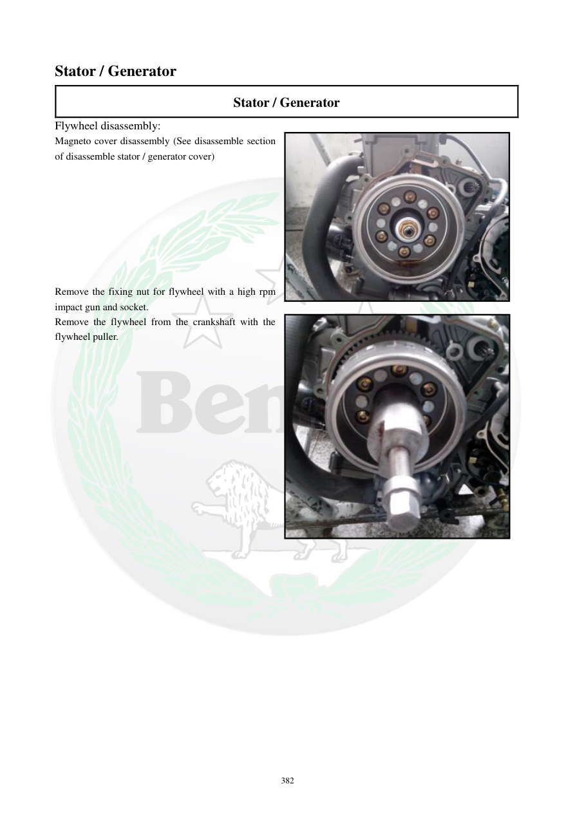

# Manual page 383

> Source: [page-0383.md](../source/page-0383.md)

## Page image / diagram

- [page-0383-img-01.jpeg](../images/embedded/page-0383-img-01.jpeg)

- [page-0383-img-02.jpeg](../images/embedded/page-0383-img-02.jpeg)

## Extracted text

# Source page 383

 
382 
Stator / Generator 
Stator / Generator 
Flywheel disassembly: 
Magneto cover disassembly (See disassemble section 
of disassemble stator / generator cover) 
 
 
 
 
 
 
 
 
Remove the fixing nut for flywheel with a high rpm 
impact gun and socket.  
Remove the flywheel from the crankshaft with the 
flywheel puller.

## Persian notes

<!-- Persian translation/explanation will be added here. -->
