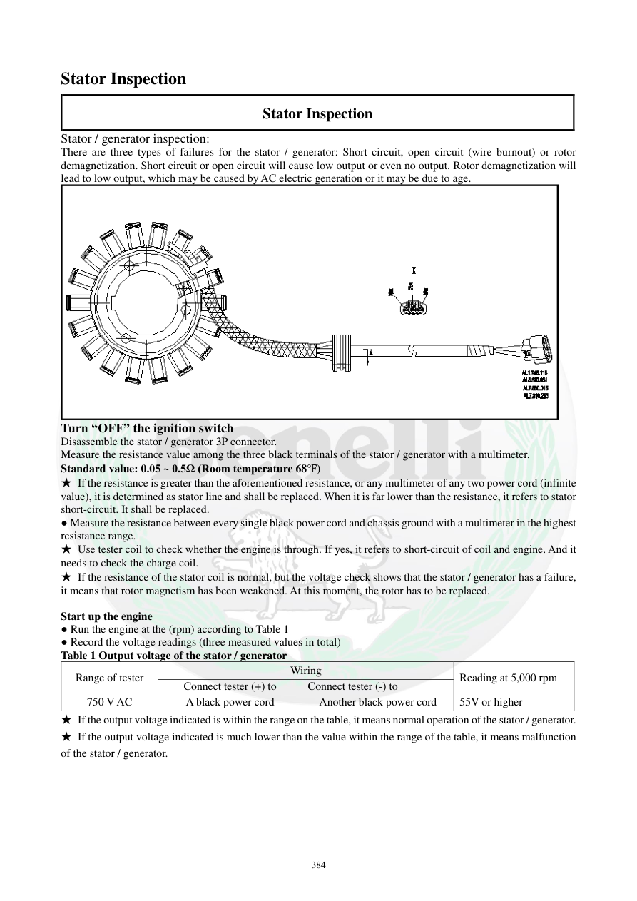

# Manual page 385

> Source: [page-0385.md](../source/page-0385.md)

## Page image / diagram

- [page-0385-img-01.png](../images/embedded/page-0385-img-01.png)

## Extracted text

# Source page 385

 
384 
Stator Inspection 
Stator Inspection 
Stator / generator inspection: 
There are three types of failures for the stator / generator: Short circuit, open circuit (wire burnout) or rotor 
demagnetization. Short circuit or open circuit will cause low output or even no output. Rotor demagnetization will 
lead to low output, which may be caused by AC electric generation or it may be due to age.  
 
Turn “OFF” the ignition switch 
Disassemble the stator / generator 3P connector.  
Measure the resistance value among the three black terminals of the stator / generator with a multimeter.  
Standard value: 0.05 ~ 0.5Ω (Room temperature 68°F)  
★ If the resistance is greater than the aforementioned resistance, or any multimeter of any two power cord (infinite 
value), it is determined as stator line and shall be replaced. When it is far lower than the resistance, it refers to stator 
short-circuit. It shall be replaced.  
● Measure the resistance between every single black power cord and chassis ground with a multimeter in the highest 
resistance range.  
★ Use tester coil to check whether the engine is through. If yes, it refers to short-circuit of coil and engine. And it 
needs to check the charge coil.  
★ If the resistance of the stator coil is normal, but the voltage check shows that the stator / generator has a failure, 
it means that rotor magnetism has been weakened. At this moment, the rotor has to be replaced.  
 
Start up the engine 
● Run the engine at the (rpm) according to Table 1   
● Record the voltage readings (three measured values in total) 
Table 1 Output voltage of the stator / generator 
Range of tester 
Wiring 
Reading at 5,000 rpm 
Connect tester (+) to 
Connect tester (-) to 
750 V AC 
A black power cord 
Another black power cord 
55V or higher 
★ If the output voltage indicated is within the range on the table, it means normal operation of the stator / generator.  
★ If the output voltage indicated is much lower than the value within the range of the table, it means malfunction 
of the stator / generator.

## Persian notes

<!-- Persian translation/explanation will be added here. -->
