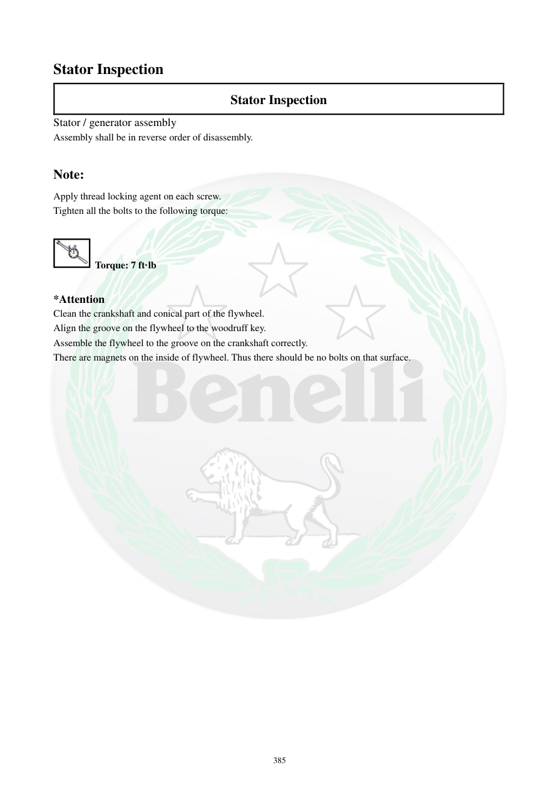

# Manual page 386

> Source: [page-0386.md](../source/page-0386.md)

## Page image / diagram

## Extracted text

# Source page 386

 
385 
Stator Inspection 
Stator Inspection 
Stator / generator assembly 
Assembly shall be in reverse order of disassembly.  
 
Note: 
Apply thread locking agent on each screw.  
Tighten all the bolts to the following torque: 
 
 Torque: 7 ft·lb 
 
*Attention 
Clean the crankshaft and conical part of the flywheel.  
Align the groove on the flywheel to the woodruff key.  
Assemble the flywheel to the groove on the crankshaft correctly.  
There are magnets on the inside of flywheel. Thus there should be no bolts on that surface.

## Persian notes

### مونتاژ استاتور و فلایویل
- مونتاژ در ترتیب معکوس بازکردن انجام شود.
- روی پیچ‌های مشخص‌شده **Thread Locker** اعمال شود.
- گشتاور پیچ‌های مشخص‌شده: **7 ft·lb**.
- سطح مخروطی میل‌لنگ و قسمت مخروطی فلایویل کاملاً تمیز باشند.
- شیار فلایویل با **Woodruff Key / خار نیم‌دایره‌ای** هم‌راستا شود.
- فلایویل باید صحیح روی قسمت مخروطی میل‌لنگ بنشیند.
- داخل فلایویل آهنربا دارد، بنابراین نباید هیچ پیچی روی سطح داخلی آن وجود داشته باشد.
