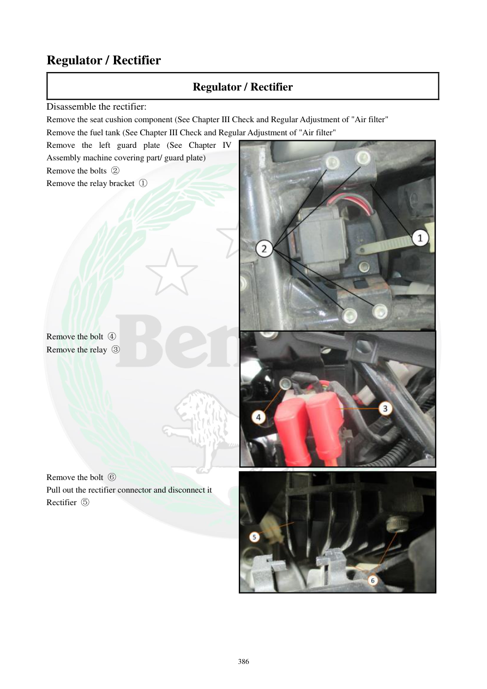

# Manual page 387

> Source: [page-0387.md](../source/page-0387.md)

## Page image / diagram

- [page-0387-img-01.jpeg](../images/embedded/page-0387-img-01.jpeg)

- [page-0387-img-02.jpeg](../images/embedded/page-0387-img-02.jpeg)

- [page-0387-img-03.jpeg](../images/embedded/page-0387-img-03.jpeg)

## Extracted text

# Source page 387

 
386 
Regulator / Rectifier 
Regulator / Rectifier 
Disassemble the rectifier: 
Remove the seat cushion component (See Chapter III Check and Regular Adjustment of "Air filter"  
Remove the fuel tank (See Chapter III Check and Regular Adjustment of "Air filter" 
Remove the left guard plate (See Chapter IV 
Assembly machine covering part/ guard plate) 
Remove the bolts ② 
Remove the relay bracket ① 
 
 
 
 
 
 
 
 
 
 
 
Remove the bolt ④ 
Remove the relay ③ 
 
 
 
 
 
 
 
 
 
Remove the bolt ⑥ 
Pull out the rectifier connector and disconnect it 
Rectifier ⑤

## Persian notes

### باز کردن رگولاتور / رکتیفایر
- صندلی و باک را طبق دستورالعمل مربوطه باز کنید.
- محافظ سمت چپ را باز کنید.
- پیچ‌های مشخص‌شده، براکت رله و سپس رله را خارج کنید.
- پیچ نگهدارنده رکتیفایر را باز کنید.
- کانکتور رکتیفایر را بیرون کشیده و جدا کنید.
- هنگام جداکردن کانکتور به سیم‌ها فشار یا کشش وارد نکنید.
- شکل صفحه محل دقیق رله، براکت، پیچ‌ها و کانکتور را نشان می‌دهد و مرجع اصلی نصب است.
