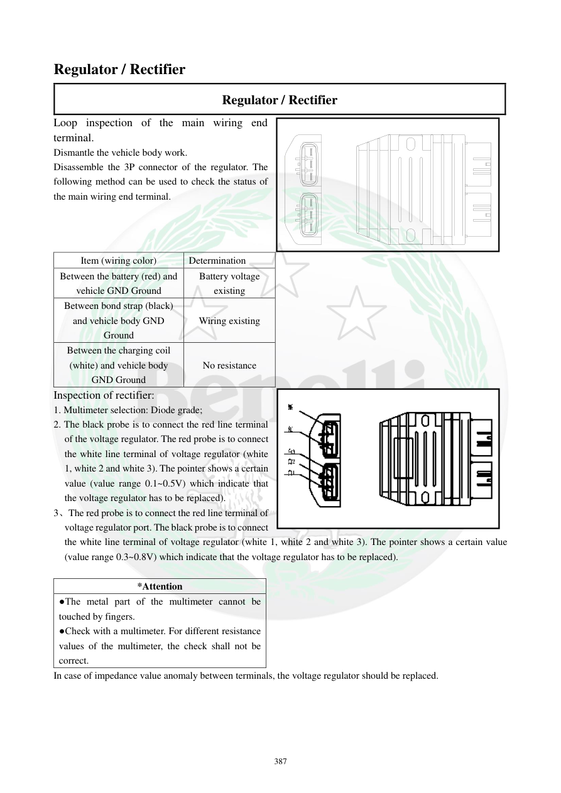

# Manual page 388

> Source: [page-0388.md](../source/page-0388.md)

## Page image / diagram

- [page-0388-img-01.png](../images/embedded/page-0388-img-01.png)

## Extracted text

# Source page 388

 
387 
Regulator / Rectifier 
Regulator / Rectifier 
Loop inspection of the main wiring end 
terminal. 
Dismantle the vehicle body work. 
Disassemble the 3P connector of the regulator. The 
following method can be used to check the status of 
the main wiring end terminal. 
Item (wiring color) 
Determination 
Between the battery (red) and 
vehicle GND Ground 
Battery voltage 
existing 
Between bond strap (black) 
and vehicle body GND 
Ground 
Wiring existing 
Between the charging coil 
(white) and vehicle body 
GND Ground 
No resistance 
Inspection of rectifier: 
1. Multimeter selection: Diode grade; 
2. The black probe is to connect the red line terminal 
of the voltage regulator. The red probe is to connect 
the white line terminal of voltage regulator (white 
1, white 2 and white 3). The pointer shows a certain 
value (value range 0.1~0.5V) which indicate that 
the voltage regulator has to be replaced).  
3、The red probe is to connect the red line terminal of 
voltage regulator port. The black probe is to connect 
the white line terminal of voltage regulator (white 1, white 2 and white 3). The pointer shows a certain value 
(value range 0.3~0.8V) which indicate that the voltage regulator has to be replaced).  
 
*Attention 
●The metal part of the multimeter cannot be 
touched by fingers.  
●Check with a multimeter. For different resistance 
values of the multimeter, the check shall not be 
correct.  
In case of impedance value anomaly between terminals, the voltage regulator should be replaced.

## Persian notes

<!-- Persian translation/explanation will be added here. -->
