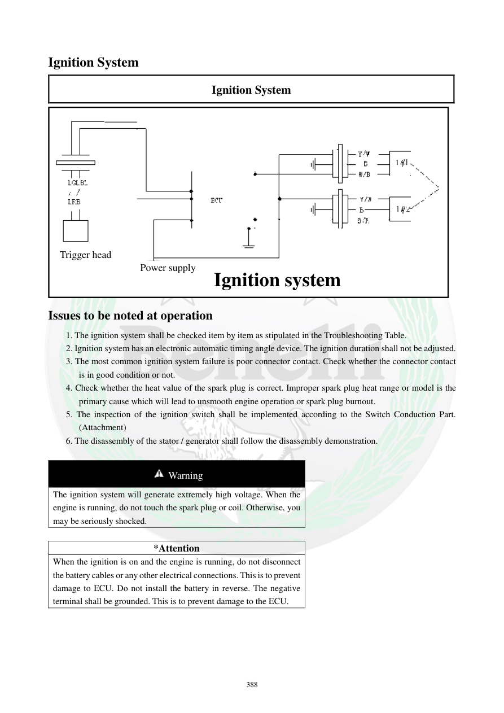

# Manual page 389

> Source: [page-0389.md](../source/page-0389.md)

## Page image / diagram

- [page-0389-img-01.png](../images/embedded/page-0389-img-01.png)

- [page-0389-img-02.png](../images/embedded/page-0389-img-02.png)

## Extracted text

# Source page 389

 
388 
Ignition System 
Ignition System 
 
Issues to be noted at operation 
1. The ignition system shall be checked item by item as stipulated in the Troubleshooting Table.  
2. Ignition system has an electronic automatic timing angle device. The ignition duration shall not be adjusted.  
3. The most common ignition system failure is poor connector contact. Check whether the connector contact 
is in good condition or not. 
4. Check whether the heat value of the spark plug is correct. Improper spark plug heat range or model is the 
primary cause which will lead to unsmooth engine operation or spark plug burnout. 
5. The inspection of the ignition switch shall be implemented according to the Switch Conduction Part. 
(Attachment) 
6. The disassembly of the stator / generator shall follow the disassembly demonstration. 
 
 Warning 
The ignition system will generate extremely high voltage. When the 
engine is running, do not touch the spark plug or coil. Otherwise, you 
may be seriously shocked.  
 
*Attention 
When the ignition is on and the engine is running, do not disconnect 
the battery cables or any other electrical connections. This is to prevent 
damage to ECU. Do not install the battery in reverse. The negative 
terminal shall be grounded. This is to prevent damage to the ECU.  
 
 
 
Trigger head 
Power supply Ignition system

## Persian notes

### نکات مهم سیستم جرقه‌زنی
- سیستم جرقه‌زنی دارای **تنظیم خودکار آوانس/زمان جرقه** است و این زمان نباید دستی تنظیم شود.
- یکی از خرابی‌های رایج، **بد بودن اتصال کانکتورها** است؛ قبل از تعویض قطعات، اتصال و وضعیت پین‌ها بررسی شود.
- محدوده حرارتی و مدل شمع باید مطابق مشخصات موتور باشد؛ شمع نامناسب می‌تواند باعث بدکارکردن موتور یا سوختن شمع شود.
- سیستم جرقه ولتاژ بسیار بالایی تولید می‌کند؛ هنگام روشن‌بودن موتور به شمع یا کویل دست نزنید.
- هنگام روشن بودن سوئیچ و موتور، کابل باتری یا اتصالات برقی را جدا نکنید تا ECU آسیب نبیند.
- باتری را برعکس نصب نکنید؛ قطب منفی باید به بدنه متصل باشد.
- شکل صفحه مسیر کلی **Trigger head → Power supply → Ignition system** را نشان می‌دهد.
