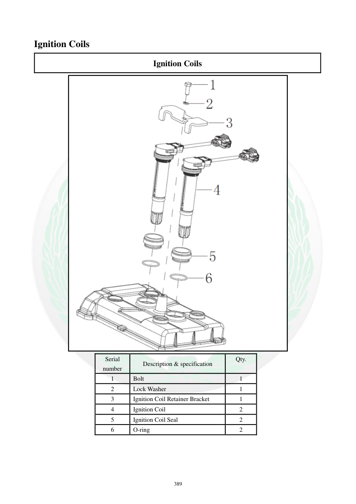

# Manual page 390

> Source: [page-0390.md](../source/page-0390.md)

## Page image / diagram

- [page-0390-img-02.png](../images/embedded/page-0390-img-02.png)

## Extracted text

# Source page 390

 
389 
Ignition Coils 
Ignition Coils 
 
Serial 
number 
Description & specification 
Qty. 
 
1 
Bolt 
1 
2 
Lock Washer 
1 
3 
Ignition Coil Retainer Bracket 
1 
4 
Ignition Coil 
2 
5 
Ignition Coil Seal 
2 
6 
O-ring 
2

## Persian notes

### اجزای کویل جرقه
طبق نمای انفجاری صفحه، مجموعه شامل:
- پیچ
- واشر فنری
- براکت نگهدارنده کویل
- **۲ عدد کویل جرقه**
- **۲ عدد آب‌بندی کویل**
- **۲ عدد O-ring**
است. برای محل و جهت نصب دقیق، تصویر صفحه مرجع اصلی است.
